# 📊 DOCUMENTACIÓN COMPLETA: APORTES DINERARIOS

## 📋 Índice

1. [Introducción](#introducción)
2. [Flujo General](#flujo-general)
3. [Arquitectura](#arquitectura)
4. [Participantes (Aportantes)](#participantes-aportantes)
5. [Contribuciones (Aportes)](#contribuciones-aportes)
6. [Votación](#votación)
7. [Endpoints Completos](#endpoints-completos)
8. [Guía de Integración Frontend](#guía-de-integración-frontend)
9. [Casos de Uso Comunes](#casos-de-uso-comunes)
10. [Troubleshooting](#troubleshooting)

---

## 🎯 Introducción

El módulo de **Aportes Dinerarios** permite registrar aumentos de capital mediante contribuciones monetarias de accionistas existentes o nuevos aportantes.

### Conceptos Clave

- **Participante (Aportante)**: Persona que puede hacer una contribución (accionista o nuevo aportante)
- **Contribución (Aporte)**: Registro del aporte monetario realizado
- **Votación**: Aprobación formal de los aportes por la junta

---

## 🔄 Flujo General

```mermaid
sequenceDiagram
    participant F as Frontend
    participant B as Backend
    participant DB as Database

    %% 1. Habilitar Aportes Dinerarios
    F->>B: PUT /agenda-items<br/>(aportesDinerarios: true)
    B->>DB: Crear ContributorsV2<br/>Crear MonetaryContributionV2<br/>Crear VoteSessionV2
    B-->>F: 200 OK

    %% 2. Seleccionar Participantes
    F->>B: GET /participants<br/>(listar accionistas)
    B-->>F: Lista de accionistas del snapshot
    
    F->>B: POST /participants<br/>(agregar nuevo aportante)
    B->>DB: Crear ShareholderV2 (NUEVO_APORTANTE)
    B-->>F: 201 Created

    F->>B: PATCH /participants<br/>(marcar como aportantes)
    B->>DB: Actualizar isContributor = true
    B-->>F: 201 OK

    %% 3. Registrar Contribuciones
    F->>B: POST /contributions<br/>(registrar aporte)
    B->>DB: Crear MonetaryContributionV2
    B-->>F: 201 Created

    F->>B: GET /contributions<br/>(listar aportes)
    B-->>F: Lista de contribuciones

    %% 4. Votación
    F->>B: POST /votes<br/>(crear votación)
    B->>DB: Crear VoteSession + VoteItem + Vote
    B-->>F: 201 Created

    F->>B: GET /votes?contexto=APORTES_DINERARIOS
    B-->>F: Datos de votación
```



---

## 🏗️ Arquitectura

### Estructura de Módulos

```
4.aporte-dinerario/
├── aporte-dinerario.module.ts        # Módulo raíz
├── participants/                      # Gestión de aportantes
│   ├── commands/
│   │   ├── add-participant/          # Agregar nuevo aportante
│   │   ├── update-participant/       # Actualizar datos
│   │   └── set-participant-contributor-status/  # Marcar como aportante
│   ├── querys/
│   │   └── find-all-participant/     # Listar participantes
│   └── domain/
│       └── entities/
│           └── aportantes.entity.ts  # Entidad Participant
└── contributions/                     # Gestión de aportes
    ├── commands/
    │   ├── create-contribution/      # Crear aporte
    │   ├── update-contribution/      # Actualizar aporte
    │   └── delete-contribution/      # Eliminar aporte
    ├── querys/
    │   └── get-all-contributions/    # Listar aportes
    └── domain/
        └── entities/
            └── contribution.entity.ts # Entidad Contribution

shared/vote/                           # Módulo de votación (compartido)
├── commands/
│   ├── create-vote/                  # Crear votación
│   └── update-vote/                  # Actualizar votación
└── querys/
    └── get-all-votes/                # Obtener votación
```

### Relación con Agenda Items

Cuando se activa `aportesDinerarios: true` en los agenda items:

```typescript
PUT /api/v2/society-profile/:societyId/register-assembly/:flowId/agenda-items

{
  "aumentoCapital": {
    "aportesDinerarios": true  // ← Activa el módulo
  }
}
```

El sistema automáticamente crea:

1. **ContributorsV2** (`contributorsId`) - Almacena los participantes
2. **MonetaryContributionV2** (`monetaryContributionId`) - Almacena las contribuciones
3. **VoteSessionV2** (`voteContributionsId`) - Maneja la votación

---

## 👥 Participantes (Aportantes)

### 1. Listar Participantes

#### Endpoint
```http
GET /api/v2/society-profile/:societyId/register-assembly/:flowId/participants
```

#### Query Parameters
| Parámetro | Tipo | Requerido | Descripción |
|-----------|------|-----------|-------------|
| `isActive` | `boolean` | No | Filtrar solo participantes activos (default: `false`) |

#### Request
```http
GET /api/v2/society-profile/34/register-assembly/128/participants?isActive=false
Authorization: Bearer {token}
```

#### Response (200 OK)
```json
{
  "success": true,
  "message": "Participantes listados correctamente.",
  "code": 200,
  "data": [
    {
      "id": "019aeadb-0993-7209-9224-fe39309e3d64",
      "personId": "019aeadb-0993-7209-9225-01616525fe68",
      "typeShareholder": "ACCIONISTA",
      "isContributor": false,
      "status": true,
      "person": {
        "id": "019aeadb-0993-7209-9225-01616525fe68",
        "tipo": "NATURAL",
        "nombre": "Juan",
        "apellidoPaterno": "Pérez",
        "apellidoMaterno": "García",
        "tipoDocumento": "DNI",
        "numeroDocumento": "00000009"
      }
    },
    {
      "id": "019aeadb-0993-7209-9225-056ef1b76108",
      "personId": "019aeadb-0993-7209-9225-098c7e307f59",
      "typeShareholder": "ACCIONISTA",
      "isContributor": false,
      "status": true,
      "person": {
        "id": "019aeadb-0993-7209-9225-098c7e307f59",
        "tipo": "NATURAL",
        "nombre": "María",
        "apellidoPaterno": "González",
        "apellidoMaterno": "López",
        "tipoDocumento": "DNI",
        "numeroDocumento": "00000010"
      }
    }
  ]
}
```

#### Tipos de Participantes

| Tipo | Descripción |
|------|-------------|
| `ACCIONISTA` | Accionista existente del snapshot |
| `NUEVO_APORTANTE` | Persona nueva que no es accionista |

---

### 2. Agregar Nuevo Participante

#### Endpoint
```http
POST /api/v2/society-profile/:societyId/register-assembly/:flowId/participants
```

#### Request Body
```typescript
{
  id: string;              // UUID v7 generado en frontend
  persona: {
    tipo: "NATURAL" | "JURIDICA";
    nombre: string;
    apellidoPaterno?: string;  // Solo para personas naturales
    apellidoMaterno?: string;  // Solo para personas naturales
    tipoDocumento: "DNI" | "CE" | "PASAPORTE" | "RUC";
    numeroDocumento: string;
    paisEmision?: string;      // Código ISO (ej: "PE")
    razonSocial?: string;      // Solo para personas jurídicas
  };
}
```

#### Request Example
```http
POST /api/v2/society-profile/34/register-assembly/128/participants
Authorization: Bearer {token}
Content-Type: application/json

{
  "id": "019aeb12-3456-7890-abcd-ef1234567890",
  "persona": {
    "tipo": "NATURAL",
    "nombre": "Carlos",
    "apellidoPaterno": "Mendoza",
    "apellidoMaterno": "Silva",
    "tipoDocumento": "DNI",
    "numeroDocumento": "87654321",
    "paisEmision": "PE"
  }
}
```

#### Response (201 Created)
```json
{
  "success": true,
  "message": "Participante creado correctamente.",
  "code": 201
}
```

#### Errores Comunes

| Código | Error | Solución |
|--------|-------|----------|
| 400 | "Contribución monetaria no esta en los puntos de agenda" | Activar `aportesDinerarios: true` en agenda items |
| 422 | "Datos inválidos" | Revisar formato de `persona` |

---

### 3. Marcar como Aportante

Este endpoint marca qué participantes harán aportes.

#### Endpoint
```http
PATCH /api/v2/society-profile/:societyId/register-assembly/:flowId/participants
```

#### Request Body
```typescript
string[]  // Array de IDs de participantes
```

#### Request Example
```http
PATCH /api/v2/society-profile/34/register-assembly/128/participants
Authorization: Bearer {token}
Content-Type: application/json

[
  "019aeadb-0993-7209-9224-fe39309e3d64",
  "019aeadb-0993-7209-9225-056ef1b76108",
  "019aeb12-3456-7890-abcd-ef1234567890"
]
```

#### Response (201 OK)
```json
{
  "success": true,
  "message": "Estado del participante actualizado correctamente.",
  "code": 201
}
```

#### Comportamiento

- Si el participante tiene `isContributor: false` → lo marca como `true`
- Si el participante tiene `isContributor: true` → lo marca como `false` (toggle)

---

## 💰 Contribuciones (Aportes)

### 1. Registrar Contribución

#### Endpoint
```http
POST /api/v2/society-profile/:societyId/register-assembly/:flowId/contributions
```

#### Request Body
```typescript
{
  id: string;                    // UUID v7
  accionistaId: string;          // ID del participante (de la lista)
  accionId: string;              // ID de la clase de acción
  tipoMoneda: "USD" | "PEN";
  monto: number;
  fechaContribucion: Date;       // ISO 8601
  tasaCambio?: number;           // Si es USD
  montoConvertido?: number;      // Monto en moneda base
  accionesPorRecibir: number;
  precioPorAccion: number;
  pagadoCompletamente: boolean;
  porcentajePagado?: number;     // Si no está pagado completamente
  totalPasivo?: number;          // Dividendo pasivo
  capitalSocial: number;         // Parte que va a capital
  premium: number;               // Prima de emisión
  reserva: number;               // Reserva legal
  comprobantePagoArchivoId: string;  // UUID del archivo en file-repository
}
```

#### Request Example
```http
POST /api/v2/society-profile/34/register-assembly/128/contributions
Authorization: Bearer {token}
Content-Type: application/json

{
  "id": "019aeb20-1111-2222-3333-444455556666",
  "accionistaId": "019aeadb-0993-7209-9224-fe39309e3d64",
  "accionId": "019aeadb-0993-7209-9225-0f05e4091ca6",
  "tipoMoneda": "PEN",
  "monto": 50000,
  "fechaContribucion": "2025-01-15T00:00:00.000Z",
  "accionesPorRecibir": 5000,
  "precioPorAccion": 10,
  "pagadoCompletamente": true,
  "porcentajePagado": 100,
  "totalPasivo": 0,
  "capitalSocial": 45000,
  "premium": 5000,
  "reserva": 0,
  "comprobantePagoArchivoId": "019aeb20-2222-3333-4444-555566667777"
}
```

#### Response (201 Created)
```json
{
  "success": true,
  "message": "Contribución creada correctamente.",
  "code": 201
}
```

#### Validaciones

1. **`accionistaId`** debe existir en `ShareholderV2` del snapshot
2. **`accionId`** debe existir en `ShareClassV2` del snapshot
3. **`monto`** debe ser > 0
4. **`capitalSocial + premium + reserva`** debe sumar el monto total (o ajustarse por tipo de cambio)
5. **`comprobantePagoArchivoId`** debe existir en `file-repository`

#### Errores Comunes

| Código | Error | Solución |
|--------|-------|----------|
| 400 | "Contribución monetaria no esta en los puntos de agenda" | Activar aportes dinerarios en agenda items |
| 404 | "Accionista no encontrado" | Verificar que el `accionistaId` sea del snapshot |
| 404 | "Clase de acción no encontrada" | Verificar que el `accionId` sea del snapshot |

---

### 2. Listar Contribuciones

#### Endpoint
```http
GET /api/v2/society-profile/:societyId/register-assembly/:flowId/contributions
```

#### Request
```http
GET /api/v2/society-profile/34/register-assembly/128/contributions
Authorization: Bearer {token}
```

#### Response (200 OK)
```json
{
  "success": true,
  "message": "Contribuciones obtenidas correctamente.",
  "code": 200,
  "data": {
    "contributions": [
      {
        "id": "019aeb20-1111-2222-3333-444455556666",
        "shareholderId": "019aeadb-0993-7209-9224-fe39309e3d64",
        "shareClassId": "019aeadb-0993-7209-9225-0f05e4091ca6",
        "currencyType": "PEN",
        "amount": 50000,
        "contributionDate": "2025-01-15T00:00:00.000Z",
        "sharesToReceive": 5000,
        "pricePerShare": 10,
        "fullyPaid": true,
        "percentagePaid": 100,
        "totalPassive": 0,
        "socialCapital": 45000,
        "premium": 5000,
        "reserve": 0,
        "paymentReceiptFileId": "019aeb20-2222-3333-4444-555566667777",
        "shareholder": {
          "id": "019aeadb-0993-7209-9224-fe39309e3d64",
          "person": {
            "nombre": "Juan",
            "apellidoPaterno": "Pérez"
          }
        },
        "shareClass": {
          "id": "019aeadb-0993-7209-9225-0f05e4091ca6",
          "tipo": "COMUN"
        }
      }
    ]
  }
}
```

---

### 3. Actualizar Contribución

#### Endpoint
```http
PUT /api/v2/society-profile/:societyId/register-assembly/:flowId/contributions/:contributionId
```

#### Request Body
Mismo formato que crear, pero todos los campos son opcionales (excepto `id`).

#### Request Example
```http
PUT /api/v2/society-profile/34/register-assembly/128/contributions/019aeb20-1111-2222-3333-444455556666
Authorization: Bearer {token}
Content-Type: application/json

{
  "id": "019aeb20-1111-2222-3333-444455556666",
  "monto": 60000,
  "accionesPorRecibir": 6000
}
```

#### Response (200 OK)
```json
{
  "success": true,
  "message": "Contribución actualizada correctamente.",
  "code": 200
}
```

---

### 4. Eliminar Contribución

#### Endpoint
```http
DELETE /api/v2/society-profile/:societyId/register-assembly/:flowId/contributions
```

#### Request Body
```typescript
string[]  // Array de IDs de contribuciones
```

#### Request Example
```http
DELETE /api/v2/society-profile/34/register-assembly/128/contributions
Authorization: Bearer {token}
Content-Type: application/json

[
  "019aeb20-1111-2222-3333-444455556666",
  "019aeb20-7777-8888-9999-000011112222"
]
```

#### Response (200 OK)
```json
{
  "success": true,
  "message": "Contribuciones eliminadas correctamente.",
  "code": 200
}
```

---

## 🗳️ Votación

### 1. Crear Votación

#### Endpoint
```http
POST /api/v2/society-profile/:societyId/register-assembly/:flowId/votes
```

#### Request Body
```typescript
{
  id: string;              // UUID v7
  contexto: "APORTES_DINERARIOS";
  modo: "SIMPLE" | "CUMULATIVO";
  items: Array<{
    id: string;           // UUID v7
    orden: number;
    label: string;        // Ej: "Aprobación de aporte de Juan Pérez"
    descripción?: string;
    personaId?: string;   // Opcional
    votos: Array<{
      id: string;         // UUID v7
      personaId: string;  // ID del accionista que vota
      valor: "A_FAVOR" | "EN_CONTRA" | "ABSTENCION" | number;
    }>;
  }>;
}
```

#### Tipos de Votación

| Modo | Descripción | `valor` |
|------|-------------|---------|
| `SIMPLE` | Un voto por accionista | `"A_FAVOR"`, `"EN_CONTRA"`, `"ABSTENCION"` |
| `CUMULATIVO` | Votos proporcionales a acciones | `number` (cantidad de acciones) |

#### Request Example (Votación Simple)
```http
POST /api/v2/society-profile/34/register-assembly/128/votes
Authorization: Bearer {token}
Content-Type: application/json

{
  "id": "019aeb30-aaaa-bbbb-cccc-ddddeeeefffff",
  "contexto": "APORTES_DINERARIOS",
  "modo": "SIMPLE",
  "items": [
    {
      "id": "019aeb30-1111-2222-3333-444455556666",
      "orden": 1,
      "label": "Aprobación de aporte de Juan Pérez por S/. 50,000",
      "descripción": "Aporte en efectivo para aumento de capital",
      "votos": [
        {
          "id": "019aeb30-2222-3333-4444-555566667777",
          "personaId": "019aeadb-0993-7209-9225-01616525fe68",
          "valor": "A_FAVOR"
        },
        {
          "id": "019aeb30-3333-4444-5555-666677778888",
          "personaId": "019aeadb-0993-7209-9225-098c7e307f59",
          "valor": "A_FAVOR"
        }
      ]
    },
    {
      "id": "019aeb30-4444-5555-6666-777788889999",
      "orden": 2,
      "label": "Aprobación de aporte de María González por S/. 30,000",
      "votos": [
        {
          "id": "019aeb30-5555-6666-7777-8888999900000",
          "personaId": "019aeadb-0993-7209-9225-01616525fe68",
          "valor": "A_FAVOR"
        },
        {
          "id": "019aeb30-6666-7777-8888-9999000011111",
          "personaId": "019aeadb-0993-7209-9225-098c7e307f59",
          "valor": "ABSTENCION"
        }
      ]
    }
  ]
}
```

#### Request Example (Votación Acumulativa)
```http
POST /api/v2/society-profile/34/register-assembly/128/votes
Authorization: Bearer {token}
Content-Type: application/json

{
  "id": "019aeb30-aaaa-bbbb-cccc-ddddeeeefffff",
  "contexto": "APORTES_DINERARIOS",
  "modo": "CUMULATIVO",
  "items": [
    {
      "id": "019aeb30-1111-2222-3333-444455556666",
      "orden": 1,
      "label": "Aprobación total del aumento de capital",
      "votos": [
        {
          "id": "019aeb30-2222-3333-4444-555566667777",
          "personaId": "019aeadb-0993-7209-9225-01616525fe68",
          "valor": 300  // 300 acciones a favor
        },
        {
          "id": "019aeb30-3333-4444-5555-666677778888",
          "personaId": "019aeadb-0993-7209-9225-098c7e307f59",
          "valor": 200  // 200 acciones a favor
        }
      ]
    }
  ]
}
```

#### Response (201 Created)
```json
{
  "success": true,
  "message": "Voto creado correctamente.",
  "code": 201
}
```

---

### 2. Obtener Votación

#### Endpoint
```http
GET /api/v2/society-profile/:societyId/register-assembly/:flowId/votes?contexto=APORTES_DINERARIOS
```

#### Request
```http
GET /api/v2/society-profile/34/register-assembly/128/votes?contexto=APORTES_DINERARIOS
Authorization: Bearer {token}
```

#### Response (200 OK)
```json
{
  "success": true,
  "message": "Votación obtenida correctamente.",
  "code": 200,
  "data": {
    "contexto": "APORTES_DINERARIOS",
    "mode": "SIMPLE",
    "items": [
      {
        "id": "019aeb30-1111-2222-3333-444455556666",
        "orden": 1,
        "label": "Aprobación de aporte de Juan Pérez por S/. 50,000",
        "descripción": "Aporte en efectivo para aumento de capital",
        "votes": [
          {
            "id": "019aeb30-2222-3333-4444-555566667777",
            "personId": "019aeadb-0993-7209-9225-01616525fe68",
            "value": "A_FAVOR",
            "person": {
              "nombre": "Juan",
              "apellidoPaterno": "Pérez"
            }
          },
          {
            "id": "019aeb30-3333-4444-5555-666677778888",
            "personId": "019aeadb-0993-7209-9225-098c7e307f59",
            "value": "A_FAVOR",
            "person": {
              "nombre": "María",
              "apellidoPaterno": "González"
            }
          }
        ]
      }
    ]
  }
}
```

---

### 3. Actualizar Votación

#### Endpoint
```http
PUT /api/v2/society-profile/:societyId/register-assembly/:flowId/votes
```

#### Request Body
```typescript
{
  contexto: "APORTES_DINERARIOS";
  items: Array<{
    accion: "create" | "update" | "delete";
    id: string;           // Solo para update/delete
    orden?: number;       // Solo para create/update
    label?: string;       // Solo para create/update
    descripción?: string; // Solo para create/update
    votos?: Array<{
      // ... igual que crear
    }>;
  }>;
}
```

#### Request Example
```http
PUT /api/v2/society-profile/34/register-assembly/128/votes
Authorization: Bearer {token}
Content-Type: application/json

{
  "contexto": "APORTES_DINERARIOS",
  "items": [
    {
      "accion": "update",
      "id": "019aeb30-1111-2222-3333-444455556666",
      "label": "Aprobación MODIFICADA de aporte de Juan Pérez"
    },
    {
      "accion": "delete",
      "id": "019aeb30-4444-5555-6666-777788889999"
    }
  ]
}
```

#### Response (200 OK)
```json
{
  "success": true,
  "message": "Voto actualizado correctamente.",
  "code": 200
}
```

---

## 📝 Endpoints Completos

### Resumen de Rutas

| Método | Ruta | Descripción |
|--------|------|-------------|
| **AGENDA ITEMS** |||
| `PUT` | `/api/v2/society-profile/:societyId/register-assembly/:flowId/agenda-items` | Habilitar aportes dinerarios |
| **PARTICIPANTES** |||
| `GET` | `/api/v2/society-profile/:societyId/register-assembly/:flowId/participants` | Listar participantes |
| `POST` | `/api/v2/society-profile/:societyId/register-assembly/:flowId/participants` | Agregar nuevo participante |
| `PATCH` | `/api/v2/society-profile/:societyId/register-assembly/:flowId/participants` | Marcar como aportante |
| **CONTRIBUCIONES** |||
| `GET` | `/api/v2/society-profile/:societyId/register-assembly/:flowId/contributions` | Listar contribuciones |
| `POST` | `/api/v2/society-profile/:societyId/register-assembly/:flowId/contributions` | Crear contribución |
| `PUT` | `/api/v2/society-profile/:societyId/register-assembly/:flowId/contributions/:id` | Actualizar contribución |
| `DELETE` | `/api/v2/society-profile/:societyId/register-assembly/:flowId/contributions` | Eliminar contribuciones |
| **VOTACIÓN** |||
| `GET` | `/api/v2/society-profile/:societyId/register-assembly/:flowId/votes?contexto=APORTES_DINERARIOS` | Obtener votación |
| `POST` | `/api/v2/society-profile/:societyId/register-assembly/:flowId/votes` | Crear votación |
| `PUT` | `/api/v2/society-profile/:societyId/register-assembly/:flowId/votes` | Actualizar votación |

---

## 🎨 Guía de Integración Frontend

### 1. Tipos TypeScript

```typescript
// 📁 types/aporte-dinerario.types.ts

export enum TipoMoneda {
  USD = 'USD',
  PEN = 'PEN'
}

export enum TipoParticipante {
  ACCIONISTA = 'ACCIONISTA',
  NUEVO_APORTANTE = 'NUEVO_APORTANTE'
}

export enum TipoPersona {
  NATURAL = 'NATURAL',
  JURIDICA = 'JURIDICA'
}

export enum TipoDocumento {
  DNI = 'DNI',
  CE = 'CE',
  PASAPORTE = 'PASAPORTE',
  RUC = 'RUC'
}

export enum ValorVoto {
  A_FAVOR = 'A_FAVOR',
  EN_CONTRA = 'EN_CONTRA',
  ABSTENCION = 'ABSTENCION'
}

export enum ModoVotacion {
  SIMPLE = 'SIMPLE',
  CUMULATIVO = 'CUMULATIVO'
}

// Persona
export interface PersonaNatural {
  tipo: TipoPersona.NATURAL;
  nombre: string;
  apellidoPaterno: string;
  apellidoMaterno: string;
  tipoDocumento: TipoDocumento;
  numeroDocumento: string;
  paisEmision?: string;
}

export interface PersonaJuridica {
  tipo: TipoPersona.JURIDICA;
  razonSocial: string;
  tipoDocumento: TipoDocumento.RUC;
  numeroDocumento: string;
  paisEmision?: string;
}

export type Persona = PersonaNatural | PersonaJuridica;

// Participante
export interface Participante {
  id: string;
  personId: string;
  typeShareholder: TipoParticipante;
  isContributor: boolean;
  status: boolean;
  person: Persona;
}

// Contribución
export interface Contribucion {
  id: string;
  accionistaId: string;
  accionId: string;
  tipoMoneda: TipoMoneda;
  monto: number;
  fechaContribucion: Date;
  tasaCambio?: number;
  montoConvertido?: number;
  accionesPorRecibir: number;
  precioPorAccion: number;
  pagadoCompletamente: boolean;
  porcentajePagado?: number;
  totalPasivo?: number;
  capitalSocial: number;
  premium: number;
  reserva: number;
  comprobantePagoArchivoId: string;
}

// Votación
export interface Voto {
  id: string;
  personaId: string;
  valor: ValorVoto | number;
}

export interface ItemVotacion {
  id: string;
  orden: number;
  label: string;
  descripción?: string;
  personaId?: string;
  votos: Voto[];
}

export interface SesionVotacion {
  id: string;
  contexto: 'APORTES_DINERARIOS';
  modo: ModoVotacion;
  items: ItemVotacion[];
}
```

---

### 2. Servicio de API

```typescript
// 📁 services/aporte-dinerario.service.ts

import { v7 as uuidv7 } from 'uuid';

export class AporteDinerarioService {
  private baseUrl: string;
  private token: string;

  constructor(baseUrl: string, token: string) {
    this.baseUrl = baseUrl;
    this.token = token;
  }

  // ==================== PARTICIPANTES ====================

  async listarParticipantes(
    societyId: number,
    flowId: number,
    isActive: boolean = false
  ): Promise<Participante[]> {
    const response = await fetch(
      `${this.baseUrl}/api/v2/society-profile/${societyId}/register-assembly/${flowId}/participants?isActive=${isActive}`,
      {
        headers: {
          Authorization: `Bearer ${this.token}`,
        },
      }
    );

    if (!response.ok) {
      throw new Error('Error al listar participantes');
    }

    const result = await response.json();
    return result.data;
  }

  async agregarParticipante(
    societyId: number,
    flowId: number,
    persona: Persona
  ): Promise<void> {
    const response = await fetch(
      `${this.baseUrl}/api/v2/society-profile/${societyId}/register-assembly/${flowId}/participants`,
      {
        method: 'POST',
        headers: {
          'Content-Type': 'application/json',
          Authorization: `Bearer ${this.token}`,
        },
        body: JSON.stringify({
          id: uuidv7(),
          persona,
        }),
      }
    );

    if (!response.ok) {
      throw new Error('Error al agregar participante');
    }
  }

  async marcarComoAportantes(
    societyId: number,
    flowId: number,
    participantIds: string[]
  ): Promise<void> {
    const response = await fetch(
      `${this.baseUrl}/api/v2/society-profile/${societyId}/register-assembly/${flowId}/participants`,
      {
        method: 'PATCH',
        headers: {
          'Content-Type': 'application/json',
          Authorization: `Bearer ${this.token}`,
        },
        body: JSON.stringify(participantIds),
      }
    );

    if (!response.ok) {
      throw new Error('Error al actualizar participantes');
    }
  }

  // ==================== CONTRIBUCIONES ====================

  async listarContribuciones(
    societyId: number,
    flowId: number
  ): Promise<Contribucion[]> {
    const response = await fetch(
      `${this.baseUrl}/api/v2/society-profile/${societyId}/register-assembly/${flowId}/contributions`,
      {
        headers: {
          Authorization: `Bearer ${this.token}`,
        },
      }
    );

    if (!response.ok) {
      throw new Error('Error al listar contribuciones');
    }

    const result = await response.json();
    return result.data.contributions;
  }

  async crearContribucion(
    societyId: number,
    flowId: number,
    contribucion: Omit<Contribucion, 'id'>
  ): Promise<void> {
    const response = await fetch(
      `${this.baseUrl}/api/v2/society-profile/${societyId}/register-assembly/${flowId}/contributions`,
      {
        method: 'POST',
        headers: {
          'Content-Type': 'application/json',
          Authorization: `Bearer ${this.token}`,
        },
        body: JSON.stringify({
          id: uuidv7(),
          ...contribucion,
        }),
      }
    );

    if (!response.ok) {
      throw new Error('Error al crear contribución');
    }
  }

  async actualizarContribucion(
    societyId: number,
    flowId: number,
    contributionId: string,
    contribucion: Partial<Contribucion>
  ): Promise<void> {
    const response = await fetch(
      `${this.baseUrl}/api/v2/society-profile/${societyId}/register-assembly/${flowId}/contributions/${contributionId}`,
      {
        method: 'PUT',
        headers: {
          'Content-Type': 'application/json',
          Authorization: `Bearer ${this.token}`,
        },
        body: JSON.stringify({
          id: contributionId,
          ...contribucion,
        }),
      }
    );

    if (!response.ok) {
      throw new Error('Error al actualizar contribución');
    }
  }

  async eliminarContribuciones(
    societyId: number,
    flowId: number,
    contributionIds: string[]
  ): Promise<void> {
    const response = await fetch(
      `${this.baseUrl}/api/v2/society-profile/${societyId}/register-assembly/${flowId}/contributions`,
      {
        method: 'DELETE',
        headers: {
          'Content-Type': 'application/json',
          Authorization: `Bearer ${this.token}`,
        },
        body: JSON.stringify(contributionIds),
      }
    );

    if (!response.ok) {
      throw new Error('Error al eliminar contribuciones');
    }
  }

  // ==================== VOTACIÓN ====================

  async obtenerVotacion(
    societyId: number,
    flowId: number
  ): Promise<SesionVotacion | null> {
    const response = await fetch(
      `${this.baseUrl}/api/v2/society-profile/${societyId}/register-assembly/${flowId}/votes?contexto=APORTES_DINERARIOS`,
      {
        headers: {
          Authorization: `Bearer ${this.token}`,
        },
      }
    );

    if (!response.ok) {
      if (response.status === 404) {
        return null; // No existe votación aún
      }
      throw new Error('Error al obtener votación');
    }

    const result = await response.json();
    return result.data;
  }

  async crearVotacion(
    societyId: number,
    flowId: number,
    votacion: Omit<SesionVotacion, 'id'>
  ): Promise<void> {
    const response = await fetch(
      `${this.baseUrl}/api/v2/society-profile/${societyId}/register-assembly/${flowId}/votes`,
      {
        method: 'POST',
        headers: {
          'Content-Type': 'application/json',
          Authorization: `Bearer ${this.token}`,
        },
        body: JSON.stringify({
          id: uuidv7(),
          ...votacion,
        }),
      }
    );

    if (!response.ok) {
      throw new Error('Error al crear votación');
    }
  }

  async actualizarVotacion(
    societyId: number,
    flowId: number,
    actualizaciones: {
      contexto: 'APORTES_DINERARIOS';
      items: Array<{
        accion: 'create' | 'update' | 'delete';
        id?: string;
        orden?: number;
        label?: string;
        descripción?: string;
        votos?: Voto[];
      }>;
    }
  ): Promise<void> {
    const response = await fetch(
      `${this.baseUrl}/api/v2/society-profile/${societyId}/register-assembly/${flowId}/votes`,
      {
        method: 'PUT',
        headers: {
          'Content-Type': 'application/json',
          Authorization: `Bearer ${this.token}`,
        },
        body: JSON.stringify(actualizaciones),
      }
    );

    if (!response.ok) {
      throw new Error('Error al actualizar votación');
    }
  }
}
```

---

### 3. Hooks de React (ejemplo)

```typescript
// 📁 hooks/useAporteDinerario.ts

import { useState, useEffect, useCallback } from 'react';
import { AporteDinerarioService } from '../services/aporte-dinerario.service';

export function useAporteDinerario(
  societyId: number,
  flowId: number,
  token: string
) {
  const [service] = useState(
    () => new AporteDinerarioService('http://localhost:3000', token)
  );

  const [participantes, setParticipantes] = useState<Participante[]>([]);
  const [contribuciones, setContribuciones] = useState<Contribucion[]>([]);
  const [votacion, setVotacion] = useState<SesionVotacion | null>(null);
  const [loading, setLoading] = useState(false);
  const [error, setError] = useState<string | null>(null);

  // Cargar participantes
  const cargarParticipantes = useCallback(async () => {
    setLoading(true);
    setError(null);
    try {
      const data = await service.listarParticipantes(societyId, flowId, false);
      setParticipantes(data);
    } catch (err) {
      setError(err.message);
    } finally {
      setLoading(false);
    }
  }, [service, societyId, flowId]);

  // Cargar contribuciones
  const cargarContribuciones = useCallback(async () => {
    setLoading(true);
    setError(null);
    try {
      const data = await service.listarContribuciones(societyId, flowId);
      setContribuciones(data);
    } catch (err) {
      setError(err.message);
    } finally {
      setLoading(false);
    }
  }, [service, societyId, flowId]);

  // Cargar votación
  const cargarVotacion = useCallback(async () => {
    setLoading(true);
    setError(null);
    try {
      const data = await service.obtenerVotacion(societyId, flowId);
      setVotacion(data);
    } catch (err) {
      setError(err.message);
    } finally {
      setLoading(false);
    }
  }, [service, societyId, flowId]);

  // Agregar participante
  const agregarParticipante = useCallback(
    async (persona: Persona) => {
      setLoading(true);
      setError(null);
      try {
        await service.agregarParticipante(societyId, flowId, persona);
        await cargarParticipantes();
      } catch (err) {
        setError(err.message);
        throw err;
      } finally {
        setLoading(false);
      }
    },
    [service, societyId, flowId, cargarParticipantes]
  );

  // Marcar como aportantes
  const marcarComoAportantes = useCallback(
    async (ids: string[]) => {
      setLoading(true);
      setError(null);
      try {
        await service.marcarComoAportantes(societyId, flowId, ids);
        await cargarParticipantes();
      } catch (err) {
        setError(err.message);
        throw err;
      } finally {
        setLoading(false);
      }
    },
    [service, societyId, flowId, cargarParticipantes]
  );

  // Crear contribución
  const crearContribucion = useCallback(
    async (contribucion: Omit<Contribucion, 'id'>) => {
      setLoading(true);
      setError(null);
      try {
        await service.crearContribucion(societyId, flowId, contribucion);
        await cargarContribuciones();
      } catch (err) {
        setError(err.message);
        throw err;
      } finally {
        setLoading(false);
      }
    },
    [service, societyId, flowId, cargarContribuciones]
  );

  // Crear votación
  const crearVotacion = useCallback(
    async (votacion: Omit<SesionVotacion, 'id'>) => {
      setLoading(true);
      setError(null);
      try {
        await service.crearVotacion(societyId, flowId, votacion);
        await cargarVotacion();
      } catch (err) {
        setError(err.message);
        throw err;
      } finally {
        setLoading(false);
      }
    },
    [service, societyId, flowId, cargarVotacion]
  );

  // Cargar todo al montar
  useEffect(() => {
    cargarParticipantes();
    cargarContribuciones();
    cargarVotacion();
  }, [cargarParticipantes, cargarContribuciones, cargarVotacion]);

  return {
    participantes,
    contribuciones,
    votacion,
    loading,
    error,
    agregarParticipante,
    marcarComoAportantes,
    crearContribucion,
    crearVotacion,
    recargar: () => {
      cargarParticipantes();
      cargarContribuciones();
      cargarVotacion();
    },
  };
}
```

---

## 💡 Casos de Uso Comunes

### Caso 1: Aumento de Capital Básico

**Escenario:** 2 accionistas existentes aportan dinero.

```typescript
// 1. Habilitar aportes dinerarios
await fetch('/api/v2/society-profile/34/register-assembly/128/agenda-items', {
  method: 'PUT',
  headers: { 'Content-Type': 'application/json', Authorization: `Bearer ${token}` },
  body: JSON.stringify({
    aumentoCapital: {
      aportesDinerarios: true,
      aporteNoDinerario: false,
      capitalizacionDeCreditos: false,
    },
    // ... otros campos en false
  }),
});

// 2. Listar accionistas existentes
const participantes = await service.listarParticipantes(34, 128, false);
// [Juan Pérez, María González]

// 3. Marcar como aportantes
await service.marcarComoAportantes(34, 128, [
  participantes[0].id, // Juan
  participantes[1].id, // María
]);

// 4. Registrar aporte de Juan
await service.crearContribucion(34, 128, {
  accionistaId: participantes[0].id,
  accionId: 'id-clase-accion-comun',
  tipoMoneda: TipoMoneda.PEN,
  monto: 50000,
  fechaContribucion: new Date('2025-01-15'),
  accionesPorRecibir: 5000,
  precioPorAccion: 10,
  pagadoCompletamente: true,
  capitalSocial: 45000,
  premium: 5000,
  reserva: 0,
  comprobantePagoArchivoId: 'archivo-id-juan',
});

// 5. Registrar aporte de María
await service.crearContribucion(34, 128, {
  accionistaId: participantes[1].id,
  accionId: 'id-clase-accion-comun',
  tipoMoneda: TipoMoneda.PEN,
  monto: 30000,
  fechaContribucion: new Date('2025-01-16'),
  accionesPorRecibir: 3000,
  precioPorAccion: 10,
  pagadoCompletamente: true,
  capitalSocial: 27000,
  premium: 3000,
  reserva: 0,
  comprobantePagoArchivoId: 'archivo-id-maria',
});

// 6. Crear votación
await service.crearVotacion(34, 128, {
  contexto: 'APORTES_DINERARIOS',
  modo: ModoVotacion.SIMPLE,
  items: [
    {
      id: uuidv7(),
      orden: 1,
      label: 'Aprobación de aporte de Juan Pérez por S/. 50,000',
      votos: [
        {
          id: uuidv7(),
          personaId: participantes[0].personId,
          valor: ValorVoto.A_FAVOR,
        },
        {
          id: uuidv7(),
          personaId: participantes[1].personId,
          valor: ValorVoto.A_FAVOR,
        },
      ],
    },
    {
      id: uuidv7(),
      orden: 2,
      label: 'Aprobación de aporte de María González por S/. 30,000',
      votos: [
        {
          id: uuidv7(),
          personaId: participantes[0].personId,
          valor: ValorVoto.A_FAVOR,
        },
        {
          id: uuidv7(),
          personaId: participantes[1].personId,
          valor: ValorVoto.A_FAVOR,
        },
      ],
    },
  ],
});
```

---

### Caso 2: Nuevo Aportante Externo

**Escenario:** Una persona nueva (no accionista) aporta dinero.

```typescript
// 1. Agregar nuevo participante
await service.agregarParticipante(34, 128, {
  tipo: TipoPersona.NATURAL,
  nombre: 'Carlos',
  apellidoPaterno: 'Mendoza',
  apellidoMaterno: 'Silva',
  tipoDocumento: TipoDocumento.DNI,
  numeroDocumento: '87654321',
  paisEmision: 'PE',
});

// 2. Recargar participantes
const participantes = await service.listarParticipantes(34, 128, false);
const carlos = participantes.find(p => p.person.numeroDocumento === '87654321');

// 3. Marcar como aportante
await service.marcarComoAportantes(34, 128, [carlos.id]);

// 4. Registrar aporte
await service.crearContribucion(34, 128, {
  accionistaId: carlos.id,
  accionId: 'id-clase-accion-comun',
  tipoMoneda: TipoMoneda.PEN,
  monto: 100000,
  fechaContribucion: new Date('2025-01-20'),
  accionesPorRecibir: 10000,
  precioPorAccion: 10,
  pagadoCompletamente: true,
  capitalSocial: 90000,
  premium: 10000,
  reserva: 0,
  comprobantePagoArchivoId: 'archivo-id-carlos',
});
```

---

### Caso 3: Aporte en Dólares

**Escenario:** Aporte en USD que debe convertirse a PEN.

```typescript
await service.crearContribucion(34, 128, {
  accionistaId: 'id-accionista',
  accionId: 'id-clase-accion',
  tipoMoneda: TipoMoneda.USD,
  monto: 10000,                  // USD 10,000
  tasaCambio: 3.75,              // Tipo de cambio
  montoConvertido: 37500,        // PEN 37,500
  fechaContribucion: new Date('2025-01-15'),
  accionesPorRecibir: 3750,
  precioPorAccion: 10,
  pagadoCompletamente: true,
  capitalSocial: 33750,          // 90% de 37,500
  premium: 3750,                 // 10% de 37,500
  reserva: 0,
  comprobantePagoArchivoId: 'archivo-id',
});
```

---

### Caso 4: Aporte Parcial (No Pagado Completamente)

**Escenario:** Accionista paga solo el 60% del aporte.

```typescript
await service.crearContribucion(34, 128, {
  accionistaId: 'id-accionista',
  accionId: 'id-clase-accion',
  tipoMoneda: TipoMoneda.PEN,
  monto: 50000,
  fechaContribucion: new Date('2025-01-15'),
  accionesPorRecibir: 5000,
  precioPorAccion: 10,
  pagadoCompletamente: false,    // ← No pagado completamente
  porcentajePagado: 60,          // ← 60%
  totalPasivo: 20000,            // ← 40% restante (dividendo pasivo)
  capitalSocial: 27000,          // 60% de 45,000
  premium: 3000,                 // 60% de 5,000
  reserva: 0,
  comprobantePagoArchivoId: 'archivo-id',
});
```

---

## 🐛 Troubleshooting

### Error 1: "Contribución monetaria no esta en los puntos de agenda"

**Causa:** No se activó `aportesDinerarios: true` en agenda items.

**Solución:**
```typescript
await fetch('/api/v2/society-profile/34/register-assembly/128/agenda-items', {
  method: 'PUT',
  headers: { 'Content-Type': 'application/json', Authorization: `Bearer ${token}` },
  body: JSON.stringify({
    aumentoCapital: {
      aportesDinerarios: true,  // ← Activar
    },
  }),
});
```

---

### Error 2: "Accionista no encontrado"

**Causa:** El `accionistaId` no existe en `ShareholderV2` del snapshot.

**Solución:**
1. Verificar que el ID sea del snapshot (no de la sociedad original)
2. Usar `GET /participants` para obtener los IDs correctos
3. Si es nuevo aportante, primero usar `POST /participants`

---

### Error 3: Votación no aparece al hacer GET

**Causa:** No se creó la votación con `POST /votes`.

**Solución:**
```typescript
// Verificar si existe votación
const votacion = await service.obtenerVotacion(34, 128);

if (!votacion) {
  // Crear votación si no existe
  await service.crearVotacion(34, 128, {
    contexto: 'APORTES_DINERARIOS',
    modo: ModoVotacion.SIMPLE,
    items: [/* ... */],
  });
}
```

---

### Error 4: "personaId no válido" en votos

**Causa:** El `personaId` en los votos debe ser del `personId` del participante, no del `shareholderId`.

**Solución:**
```typescript
const participantes = await service.listarParticipantes(34, 128);

// ✅ CORRECTO
{
  id: uuidv7(),
  personaId: participantes[0].personId,  // ← personId
  valor: ValorVoto.A_FAVOR
}

// ❌ INCORRECTO
{
  id: uuidv7(),
  personaId: participantes[0].id,  // ← shareholderId (mal)
  valor: ValorVoto.A_FAVOR
}
```

---

### Error 5: Contribución rechazada por sumas incorrectas

**Causa:** `capitalSocial + premium + reserva ≠ monto`

**Solución:**
```typescript
const monto = 50000;
const capitalSocial = monto * 0.9;  // 90%
const premium = monto * 0.1;        // 10%
const reserva = 0;

// Verificar: 45000 + 5000 + 0 = 50000 ✅
```

---

## 📚 Referencias

- [Arquitectura Completa de Juntas](./ARQUITECTURA-COMPLETA-JUNTAS.md)
- [Guía Frontend Snapshot](./GUIA-FRONTEND-SNAPSHOT.md)
- [Endpoints Referencia Rápida](./ENDPOINTS-REFERENCIA-RAPIDA.md)
- Prisma Schema: `ShareholderV2`, `MonetaryContributionV2`, `VoteSessionV2`

---

## 🎯 Checklist de Implementación

### Backend (✅ Completado)
- [x] Módulo `AporteDinerarioModule`
- [x] Submódulo `ParticipantModule`
- [x] Submódulo `ContributionModule`
- [x] Módulo `VoteModule` (compartido)
- [x] Endpoints de participantes
- [x] Endpoints de contribuciones
- [x] Endpoints de votación
- [x] Validaciones de negocio
- [x] Integración con agenda items

### Frontend (⏳ Pendiente)
- [ ] Tipos TypeScript
- [ ] Servicio de API
- [ ] Hook `useAporteDinerario`
- [ ] Componente de listado de participantes
- [ ] Componente de formulario de participante
- [ ] Componente de listado de contribuciones
- [ ] Componente de formulario de contribución
- [ ] Componente de votación
- [ ] Validaciones en formularios
- [ ] Manejo de errores
- [ ] Tests unitarios
- [ ] Tests de integración

---

**Última actualización:** 5 de diciembre de 2025  
**Versión:** 1.0.0  
**Autor:** Backend Team + AI Assistant

