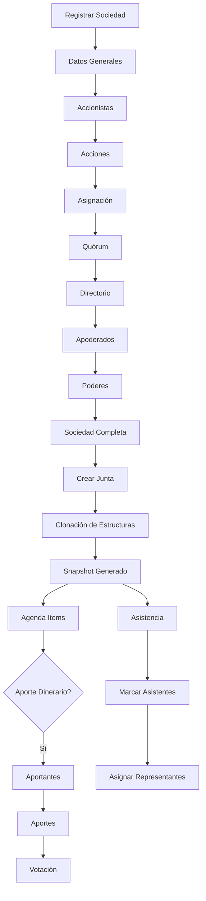

# 📚 ARQUITECTURA COMPLETA: Registro de Sociedades → Juntas

## 🎯 Resumen Ejecutivo

Este documento explica el flujo completo desde el registro de una sociedad hasta la creación y gestión de juntas (asambleas), incluyendo el concepto clave del **Snapshot** y cómo se relaciona con módulos como **Aporte Dinerario** y **Asistencia**.

---

## 📋 Índice

1. [Flujo General del Sistema](#1-flujo-general-del-sistema)
2. [Paso 1: Registro de Sociedad](#2-paso-1-registro-de-sociedad)
3. [Paso 2: Creación de Junta (Clonación)](#3-paso-2-creación-de-junta-clonación)
4. [Paso 3: El Snapshot](#4-paso-3-el-snapshot)
5. [Paso 4: Aporte Dinerario](#5-paso-4-aporte-dinerario)
6. [Paso 5: Asistencia](#6-paso-5-asistencia)
7. [Endpoints Principales](#7-endpoints-principales)
8. [Diagramas](#8-diagramas)

---

## 1. Flujo General del Sistema



---

## 2. Paso 1: Registro de Sociedad

### 2.1. Pasos del Registro

| Paso | Módulo         | Descripción                    | Endpoint                                                       |
| ---- | -------------- | ------------------------------ | -------------------------------------------------------------- |
| 0    | Crear Sociedad | Crear perfil básico            | `POST /api/v2/society-profile`                                 |
| 1    | Datos Sociedad | Tipo, razón social, etc.       | `PUT /api/v2/society-profile/:id/society`                      |
| 2    | Accionistas    | Personas naturales/jurídicas   | `POST /api/v2/society-profile/:id/shareholder`                 |
| 3    | Acciones       | Clases de acciones             | `POST /api/v2/society-profile/:id/acction`                     |
| 4    | Asignación     | Asignar acciones a accionistas | `POST /api/v2/society-profile/:id/share-assignment`            |
| 5    | Quórum         | Definir quórums y mayorías     | `PUT /api/v2/society-profile/:id/quorum`                       |
| 6    | Directorio     | Agregar directores             | `POST /api/v2/society-profile/:id/directorio/directores`       |
| 7    | Apoderados     | Agregar apoderados             | `POST /api/v2/society-profile/:id/attorney-register/attorneys` |
| 8    | Poderes        | Definir facultades             | `POST /api/v2/society-profile/:id/power-regime/powers`         |

### 2.2. Estructura en Base de Datos

```typescript
SocietyProfile (ID: 1)
├── SocietyData (datos generales)
├── ShareholderStructure (ID: "uuid-1")
│   └── ShareholderV2[] (accionistas)
├── NominalValue (ID: "uuid-2")
│   └── ShareClass[] (clases de acciones)
├── ShareAllocationStructure (ID: "uuid-3")
│   └── ShareAssignment[] (asignaciones)
├── QuorumV2 (ID: "uuid-4")
├── DirectoryV2 (ID: "uuid-5")
│   └── Director[] (directores)
├── AttorneyRegistryV2 (ID: "uuid-6")
│   └── AttorneyV2[] (apoderados)
└── PowerRegimen (ID: "uuid-7")
    └── Power[] (poderes)
```

---

## 3. Paso 2: Creación de Junta (Clonación)

### 3.1. ¿Qué sucede al crear una Junta?

Cuando se crea una junta, el sistema **clona** todas las estructuras de la sociedad:

```typescript
// Endpoint
POST /api/v2/society-profile/:societyId/register-assembly

// Handler: CreateFlowBaseHandler
1. Ejecuta CloneSocietyStructuresService.cloneFromSocietyStructure(societyId)
2. Crea SocietyGeneralFlowStructure con las nuevas referencias
3. Retorna flowId
```

### 3.2. Servicio de Clonación

**Archivo:** `clone-society-structures.service.ts`

**Proceso:**

```typescript
async cloneFromSocietyStructure(societyStructureId: number) {
  // 1. Cargar estructura original
  const source = await this.loadSocietyStructure(societyStructureId);

  // 2. Generar nuevos IDs para todo
  const idMap = this.buildIdMap(source);

  // 3. Clonar estructuras
  await this.cloneShareholders(source, idMap);
  await this.cloneShareClasses(source, idMap);
  await this.cloneShareAllocations(source, idMap);
  await this.cloneDirectory(source, idMap);
  await this.cloneAttorneys(source, idMap);
  await this.clonePowers(source, idMap);
  await this.cloneQuorums(source, idMap);
  await this.cloneSpecialAgreements(source, idMap);

  // 4. Crear registros de asistencia (MeetingAttendanceV2)
  await this.buildAttendanceRecords(source, idMap);

  // 5. Retornar IDs de las nuevas estructuras
  return {
    societyProfileId,
    shareholderStructureId: idMap.shareholderStructureId,
    nominalValueId: idMap.nominalValueId,
    shareAllocationStructureId: idMap.shareAllocationStructureId,
    meetingConfigId: idMap.meetingConfigId,
    directoryId: idMap.directoryId,
    attorneyRegistryId: idMap.attorneyRegistryId,
    powerRegimenId: idMap.powerRegimenId,
    quorumId: idMap.quorumId,
    specialAgreementsId: idMap.specialAgreementsId,
  };
}
```

### 3.3. ¿Por qué se clona?

**Razones:**

1. **Inmutabilidad:** La junta NO modifica la sociedad original
2. **Histórico:** Cada junta tiene su propio snapshot de datos
3. **Independencia:** Cambios en una junta no afectan otras
4. **Comparación:** Permite ver evolución entre juntas

**Ejemplo:**

```
Sociedad (2024-01-01)
├── Accionista A: 100 acciones
└── Accionista B: 200 acciones

Junta 1 (2024-06-01) - Snapshot
├── Accionista A: 100 acciones  ← Clonado
└── Accionista B: 200 acciones  ← Clonado

Junta 2 (2024-12-01) - Snapshot
├── Accionista A: 150 acciones  ← Nuevo snapshot
└── Accionista B: 250 acciones  ← Reflejando cambios
```

---

## 4. Paso 3: El Snapshot

### 4.1. ¿Qué es el Snapshot?

El **Snapshot** es una fotografía completa de la sociedad en el momento de crear la junta. Incluye:

- ✅ Accionistas
- ✅ Acciones
- ✅ Asignaciones
- ✅ Directorio
- ✅ Apoderados
- ✅ Poderes
- ✅ Quórums
- ✅ Acuerdos especiales
- ✅ **Registros de asistencia pre-creados**

### 4.2. Endpoint del Snapshot

```typescript
GET /api/v2/society-profile/:societyId/register-assembly/:flowId/snapshot/complete
```

**Handler:** `GetSnapshotCompleteHandler`

**Proceso:**

```typescript
async execute(query: GetSnapshotCompleteQuery): Promise<SnapshotCompleteDto> {
  // 1. Obtener flowStructure
  const flowStructure = await this.structureRepository.findById(
    query.societyId,
    query.flowId
  );

  // 2. Obtener TODOS los datos en paralelo (Promise.all)
  const [
    shareholders,        // Accionistas clonados
    shareAllocations,    // Asignaciones clonadas
    shareClasses,        // Clases de acciones clonadas
    nominalValue,        // Valor nominal
    meetingConfig,       // Configuración de junta
    flowInfo,            // Info del flujo
    directory,           // Directorio clonado
    directors,           // Directores clonados
    attorneys,           // Apoderados clonados
    powers,              // Poderes clonados
    quorum,              // Quórums clonados
    specialAgreements,   // Acuerdos clonados
    societyData,         // Datos de la sociedad
  ] = await Promise.all([...]);

  // 3. Retornar DTO completo
  return new SnapshotCompleteDto({ ... });
}
```

### 4.3. Estructura del Snapshot

```typescript
interface SnapshotCompleteDto {
  // IDs de las estructuras clonadas
  shareholderId: string;
  nominalValueId: string;
  shareAllocationId: string;
  meetingConfigId: string;
  directoryId?: string;
  attorneyRegistryId?: string;
  powerRegimenId?: string;
  quorumId?: string;
  specialAgreementsId?: string;

  // Datos completos
  nominalValue: number;
  shareClasses: AccionResponseDto[];
  shareholders: ShareholderReadDto[];
  shareAllocations: AsignacionDetalleQueryResponseDto[];
  directory?: DirectorioQueryResponseDto;
  directors?: DirectorQueryResponseDto[];
  attorneys?: ApoderadoReadDto[];
  powers?: PowerDto;
  quorums?: QuorumResponseDto;
  specialAgreements?: AcuerdoEspecialQueryResponseDto;
  societyData?: SocietyReadDto;
  meetingConfig: {
    id: string;
    meetingType: string;
    isAnnualMandatory: boolean;
  };
  flowInfo: {
    flowStructureId: number;
    currentStep: string;
    statusProgression: string;
  };
}
```

---

## 5. Paso 4: Aporte Dinerario

### 5.1. ¿Qué es Aporte Dinerario?

Módulo para registrar aportes monetarios de accionistas en una junta. Tiene **3 pasos**:

1. **Aportantes:** Definir quiénes aportarán
2. **Aportes:** Registrar los montos
3. **Votación:** Aprobar los aportes

### 5.2. Relación con el Snapshot

```mermaid
graph LR
    A[Snapshot] --> B[shareholderId]
    B --> C[ShareholderV2[]]
    C --> D{Es Aportante?}
    D -->|Sí| E[Marcar isContributor=true]
    E --> F[Registrar Aportes]
    F --> G[MonetaryContributionItemV2]
```

### 5.3. Endpoints

```typescript
// 1. Listar aportantes (usando shareholderId del snapshot)
GET /api/v2/society-profile/:societyId/assembly/:flowId/participants

// 2. Marcar como aportante
PUT /api/v2/society-profile/:societyId/assembly/:flowId/participants/:id/contributor

// 3. Crear aporte
POST /api/v2/society-profile/:societyId/assembly/:flowId/contributions

// 4. Listar aportes
GET /api/v2/society-profile/:societyId/assembly/:flowId/contributions
```

### 5.4. Estructura de Datos

```typescript
// 1. Aportantes (usando shareholderV2 del snapshot)
interface Participant {
  id: string; // ShareholderV2.id
  structureId: string; // shareholderId del snapshot
  personId: string;
  typeShareholder: string;
  isContributor: boolean; // ← Se marca aquí
}

// 2. Aportes
interface Contribution {
  id: string;
  structureId: string; // monetaryContributionId
  shareholderId: string; // Referencia al aportante
  actionId: string; // Clase de acción
  currency: 'PEN' | 'USD';
  amount: number;
  contributionDate: Date;
  sharesToReceive: number;
  pricePerShare: number;
  fullyPaid: boolean;
  socialCapital: number;
  premium: number;
  reserve: number;
  accountingEntryFileId: string;
}
```

### 5.5. Flujo de Creación

```typescript
// Handler: CreateContributionHandler
async execute(command: CreateContributionCommand) {
  // 1. Obtener estructura del flujo
  const structure = await this.structureRepository.findById(
    command.societyId,
    command.flowId
  );

  // 2. Verificar que monetaryContributionId existe
  if (!structure.monetaryContributionId) {
    throw new BadRequestException(
      'Contribución monetaria no esta en los puntos de agenda'
    );
  }

  // 3. Crear aporte vinculado al structureId
  const aggregate = Contribution.createNew({
    ...command.contribution,
    structureId: structure.monetaryContributionId,  // ← Clave
  });

  // 4. Guardar en MonetaryContributionItemV2
  await this.repository.save(aggregate);
}
```

---

## 6. Paso 5: Asistencia

### 6.1. ¿Qué es Asistencia?

Módulo para registrar quiénes asisten a la junta y quiénes son representados.

### 6.2. Relación con el Snapshot

**Clave:** Los registros de asistencia se **crean automáticamente** durante la clonación:

```typescript
// En clone-society-structures.service.ts
async buildAttendanceRecords(source, idMap) {
  const attendanceRecords = [];

  // Por cada accionista clonado
  for (const shareholder of source.shareholders) {
    const newShareholderId = idMap.shareholderIdMap.get(shareholder.id);

    // Calcular acciones con derecho a voto
    const sharesWithVote = this.calculateSharesWithVote(
      shareholder,
      source.shareAllocations
    );

    // Calcular porcentaje de participación
    const participationPct = this.calculateParticipationPct(
      sharesWithVote,
      totalShares
    );

    // Crear registro de asistencia
    attendanceRecords.push({
      id: v7(),
      meetingConfigId: idMap.meetingConfigId,
      shareholderId: newShareholderId,
      sharesWithVote,
      participationPct,
      attended: false,              // ← Inicialmente false
      representedById: null,        // ← Sin representante
      isRepresentative: false,      // ← No es representante
    });
  }

  // Guardar todos los registros
  await prisma.meetingAttendanceV2.createMany({
    data: attendanceRecords,
  });
}
```

### 6.3. Endpoints

```typescript
// 1. Obtener lista de asistencia (pre-creada)
GET /api/v2/society-profile/:societyId/register-assembly/:flowId/attendance

// 2. Actualizar asistencia
PUT /api/v2/society-profile/:societyId/register-assembly/:flowId/attendance
```

### 6.4. Estructura de Datos

```typescript
interface Attendance {
  id: string;
  configJuntaId: string; // meetingConfigId del snapshot
  shareholderId: string; // Accionista clonado
  sharesWithVote: number; // ← Calculado automáticamente
  participationPct: number; // ← Calculado automáticamente
  attended: boolean; // ← Se actualiza en el frontend
  representedById: string | null; // ← Se asigna si es representado
  isRepresentative: boolean; // ← Se marca si es representante
}
```

### 6.5. Flujo de Actualización

```typescript
// Handler: UpdateAttendanceHandler
async execute(command: UpdateAttendanceCommand) {
  // 1. Obtener estructura del flujo
  const structure = await this.structureRepository.findById(
    command.societyId,
    command.flowId
  );

  // 2. Obtener registro de asistencia (ya existe)
  const attendance = await this.repository.findById(
    structure.meetingConfigId,  // ← Clave
    command.dto.id
  );

  // 3. Actualizar estado
  command.dto.attended
    ? attendance.marcarAsistencia()
    : attendance.marcarInasistencia();

  // 4. Asignar/quitar representante
  if (command.dto.representedById) {
    attendance.asignarRepresentante(command.dto.representedById);
  }

  // 5. Marcar como representante
  command.dto.isRepresentative
    ? attendance.marcarComoRepresentante()
    : attendance.desmarcarComoRepresentante();

  // 6. Guardar
  await this.repository.save(attendance);
}
```

---

## 7. Endpoints Principales

### 7.1. Sociedad

| Método | Endpoint                                                  | Descripción           |
| ------ | --------------------------------------------------------- | --------------------- |
| POST   | `/api/v2/society-profile`                                 | Crear sociedad        |
| PUT    | `/api/v2/society-profile/:id/society`                     | Datos generales       |
| POST   | `/api/v2/society-profile/:id/shareholder`                 | Crear accionista      |
| POST   | `/api/v2/society-profile/:id/acction`                     | Crear clase de acción |
| POST   | `/api/v2/society-profile/:id/share-assignment`            | Asignar acciones      |
| PUT    | `/api/v2/society-profile/:id/quorum`                      | Definir quórums       |
| POST   | `/api/v2/society-profile/:id/directorio/directores`       | Crear director        |
| POST   | `/api/v2/society-profile/:id/attorney-register/attorneys` | Crear apoderado       |
| POST   | `/api/v2/society-profile/:id/power-regime/powers`         | Crear poder           |

### 7.2. Junta

| Método | Endpoint                                                                  | Descripción                     |
| ------ | ------------------------------------------------------------------------- | ------------------------------- |
| POST   | `/api/v2/society-profile/:id/register-assembly`                           | Crear junta (clona estructuras) |
| GET    | `/api/v2/society-profile/:id/register-assembly/list`                      | Listar juntas                   |
| GET    | `/api/v2/society-profile/:id/register-assembly/:flowId/snapshot/complete` | **Obtener snapshot completo**   |

### 7.3. Agenda Items

| Método | Endpoint                                                    | Descripción                 |
| ------ | ----------------------------------------------------------- | --------------------------- |
| GET    | `/api/v2/society-profile/:id/assembly/:flowId/agenda-items` | Obtener puntos de agenda    |
| PUT    | `/api/v2/society-profile/:id/assembly/:flowId/agenda-items` | Actualizar puntos de agenda |

### 7.4. Aporte Dinerario

| Método | Endpoint                                                                     | Descripción                   |
| ------ | ---------------------------------------------------------------------------- | ----------------------------- |
| GET    | `/api/v2/society-profile/:id/assembly/:flowId/participants`                  | Listar aportantes potenciales |
| PUT    | `/api/v2/society-profile/:id/assembly/:flowId/participants/:pid/contributor` | Marcar como aportante         |
| POST   | `/api/v2/society-profile/:id/assembly/:flowId/contributions`                 | Crear aporte                  |
| GET    | `/api/v2/society-profile/:id/assembly/:flowId/contributions`                 | Listar aportes                |

### 7.5. Asistencia

| Método | Endpoint                                                           | Descripción                     |
| ------ | ------------------------------------------------------------------ | ------------------------------- |
| GET    | `/api/v2/society-profile/:id/register-assembly/:flowId/attendance` | Obtener asistencia (pre-creada) |
| PUT    | `/api/v2/society-profile/:id/register-assembly/:flowId/attendance` | Actualizar asistencia           |

---

## 8. Diagramas

### 8.1. Relación entre Entidades

```
SocietyGeneralFlowStructureV2
├── societyGeneralFlowId (FK → SocietyGeneralFlowV2)
├── meetingConfigId (FK → GeneralMeetingConfigV2)
│   └── MeetingAttendanceV2[] ← Asistencia (pre-creada en clonación)
├── shareholderId (FK → ShareholderStructure)
│   └── ShareholderV2[] ← Aportantes potenciales
├── nominalValueId (FK → NominalValue)
│   └── ShareClass[] ← Clases de acciones
├── shareAllocationId (FK → ShareAllocationStructure)
│   └── ShareAssignment[] ← Asignaciones
├── directoryId (FK → DirectoryV2)
│   └── Director[] ← Directores
├── attorneyRegistryId (FK → AttorneyRegistryV2)
│   └── AttorneyV2[] ← Apoderados
├── powerRegimenId (FK → PowerRegimen)
│   └── Power[] ← Poderes
├── quorumId (FK → QuorumV2)
├── specialAgreementsId (FK → SpecialAgreementsV2)
│
├── contributorsId (FK → ShareholderStructure) ← Para aportantes
├── monetaryContributionId (FK → MonetaryContributionV2)
│   └── MonetaryContributionItemV2[] ← Aportes
└── voteContributionsId (FK → VoteSession) ← Votación de aportes
```

### 8.2. Flujo de Datos

```
┌─────────────────┐
│   Sociedad      │
│   (Original)    │
└────────┬────────┘
         │
         │ POST /register-assembly
         ▼
┌─────────────────┐
│  Clonación      │  ← CloneSocietyStructuresService
│  (Nuevos IDs)   │
└────────┬────────┘
         │
         ├─→ Accionistas clonados
         ├─→ Acciones clonadas
         ├─→ Asignaciones clonadas
         ├─→ Directorio clonado
         ├─→ Apoderados clonados
         ├─→ Poderes clonados
         ├─→ Quórums clonados
         └─→ Asistencia pre-creada ★
         │
         ▼
┌─────────────────┐
│  Snapshot       │  ← GET /snapshot/complete
│  (Foto actual)  │
└────────┬────────┘
         │
         ├─→ Frontend lee snapshot
         ├─→ Muestra lista de aportantes
         ├─→ Muestra lista de asistencia
         │
         ▼
┌─────────────────┐
│  Operaciones    │
│  de Junta       │
└─────────────────┘
         │
         ├─→ Marcar aportantes (isContributor=true)
         ├─→ Registrar aportes (MonetaryContributionItemV2)
         ├─→ Actualizar asistencia (MeetingAttendanceV2)
         └─→ Votar aportes (VoteSession)
```

---

## 9. Conceptos Clave

### 9.1. ¿Por qué el Snapshot es importante?

1. **Inmutabilidad:** La sociedad original NO cambia
2. **Histórico:** Cada junta tiene su propio estado
3. **Independencia:** Cambios en una junta no afectan otras
4. **Pre-carga:** Asistencia y aportantes ya están disponibles

### 9.2. ¿Cómo se relacionan Snapshot, Aporte y Asistencia?

```
Snapshot (Foto de la sociedad)
│
├── shareholderId → ShareholderV2[]
│   │
│   ├─→ Aporte Dinerario: Usa shareholderId para listar aportantes
│   │   └─→ Marca isContributor=true en ShareholderV2
│   │
│   └─→ Asistencia: Pre-crea MeetingAttendanceV2 para cada ShareholderV2
│       └─→ Calcula automáticamente sharesWithVote y participationPct
│
└── meetingConfigId → GeneralMeetingConfigV2
    └─→ Asistencia: Agrupa registros por meetingConfigId
```

### 9.3. Ventajas de esta Arquitectura

✅ **Separación de responsabilidades:** Cada módulo tiene su dominio  
✅ **Reutilización:** Snapshot sirve para múltiples módulos  
✅ **Performance:** Clonación inicial evita queries repetidos  
✅ **Consistencia:** Todos usan la misma fuente de verdad (snapshot)  
✅ **Escalabilidad:** Fácil agregar nuevos módulos que usen el snapshot

---

## 10. Preguntas Frecuentes

**Q: ¿Por qué clonar todo en lugar de usar referencias?**  
A: Para mantener inmutabilidad y tener histórico. Cada junta es independiente.

**Q: ¿Cuándo se crea la asistencia?**  
A: Durante la clonación, automáticamente para cada accionista.

**Q: ¿Cómo se relaciona el aporte con el snapshot?**  
A: Usa `shareholderId` del snapshot para listar aportantes potenciales.

**Q: ¿Qué pasa si cambio un accionista en la sociedad después de crear la junta?**  
A: No afecta la junta. La junta usa su propio snapshot clonado.

**Q: ¿Cómo se actualiza el snapshot?**  
A: No se actualiza. Es una foto inmutable. Cada nueva junta genera un nuevo snapshot.

---

## 11. Archivos Clave

| Archivo                                    | Descripción                              |
| ------------------------------------------ | ---------------------------------------- |
| `clone-society-structures.service.ts`      | Servicio que clona todas las estructuras |
| `get-snapshot-complete.handler.ts`         | Handler que obtiene el snapshot completo |
| `snapshot-complete.dto.ts`                 | DTO del snapshot                         |
| `contribution.entity.ts`                   | Entidad de aporte dinerario              |
| `attendace.entity.ts`                      | Entidad de asistencia                    |
| `society-general-flow-structure.entity.ts` | Entidad raíz del flujo                   |

---

**Última actualización:** 2025-12-04  
**Versión:** 1.0
