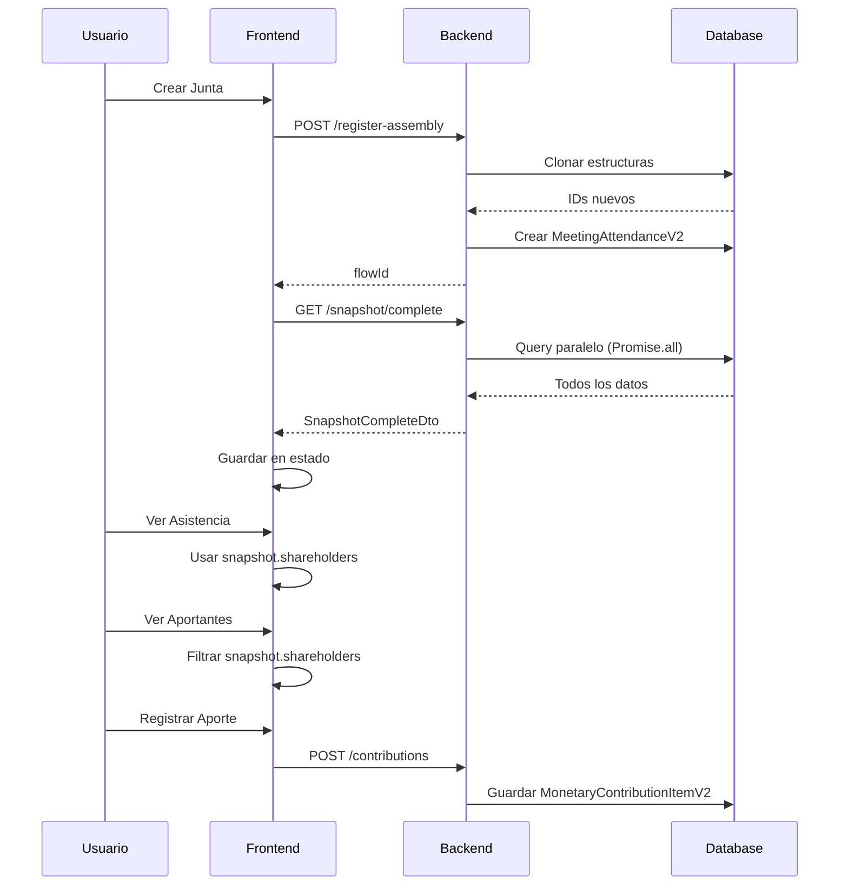

# 🎨 GUÍA FRONTEND: Cómo usar el Snapshot

## 📋 Índice

1. [Introducción](#1-introducción)
2. [Flujo Completo en el Frontend](#2-flujo-completo-en-el-frontend)
3. [Tipos TypeScript](#3-tipos-typescript)
4. [Paso a Paso](#4-paso-a-paso)
5. [Ejemplos de Código](#5-ejemplos-de-código)
6. [Casos de Uso Comunes](#6-casos-de-uso-comunes)
7. [Troubleshooting](#7-troubleshooting)

---

## 1. Introducción

El **Snapshot** es el corazón de la gestión de juntas. Contiene toda la información clonada de la sociedad y sirve como base para:

- ✅ Mostrar accionistas en Asistencia
- ✅ Listar aportantes potenciales
- ✅ Calcular porcentajes de participación
- ✅ Validar datos de la junta

---

## 2. Flujo Completo en el Frontend



---

## 3. Tipos TypeScript

### 3.1. Snapshot Completo

```typescript
// frontend/types/snapshot.types.ts

export interface SnapshotCompleteDto {
  // IDs de estructuras clonadas
  shareholderId: string;
  nominalValueId: string;
  shareAllocationId: string;
  meetingConfigId: string;
  directoryId?: string;
  attorneyRegistryId?: string;
  powerRegimenId?: string;
  quorumId?: string;
  specialAgreementsId?: string;

  // Datos completos
  nominalValue: number;
  shareClasses: ShareClass[];
  shareholders: Shareholder[];
  shareAllocations: ShareAllocation[];
  directory?: Directory;
  directors?: Director[];
  attorneys?: Attorney[];
  powers?: Powers;
  quorums?: Quorum;
  specialAgreements?: SpecialAgreements;
  societyData?: SocietyData;
  
  // Configuración de junta
  meetingConfig: {
    id: string;
    meetingType: string;
    isAnnualMandatory: boolean;
  };
  
  // Información del flujo
  flowInfo: {
    flowStructureId: number;
    currentStep: string;
    statusProgression: string;
  };
}

export interface Shareholder {
  id: string;
  personId: string;
  typeShareholder: 'FUNDADOR' | 'NUEVO';
  isContributor: boolean;
  persona: Person;
}

export interface Person {
  id: string;
  type: 'NATURAL' | 'JURIDIC';
  natural?: {
    firstName: string;
    lastNamePaternal: string;
    lastNameMaternal: string;
    typeDocument: string;
    documentNumber: string;
    issuingCountry: string;
  };
  juridic?: {
    businessName: string;
    ruc: string;
    country: string;
  };
}

export interface ShareClass {
  id: string;
  claseAccion: string;
  cantidadAcciones: number;
  valorAccion: number;
  derecho: 'VOTO_Y_ECONOMICO' | 'SOLO_ECONOMICO';
}

export interface ShareAllocation {
  id: string;
  shareholderId: string;
  shareClassId: string;
  cantidadAcciones: number;
  porcentajeCapital: number;
}
```

### 3.2. Asistencia

```typescript
export interface Attendance {
  id: string;
  configJuntaId: string;
  accionista: Shareholder;
  accionesConDerechoVoto: number;
  porcentajeParticipacion: number;
  asistio: boolean;
  representadoPorId: string | null;
  esRepresentante: boolean;
}

export interface UpdateAttendanceDto {
  id: string;
  attended: boolean;
  representedById?: string;
  isRepresentative: boolean;
}
```

### 3.3. Aporte Dinerario

```typescript
export interface Participant {
  id: string;
  personId: string;
  typeShareholder: string;
  isContributor: boolean;
  persona: Person;
}

export interface Contribution {
  id: string;
  accionistaId: string;
  accionId: string;
  tipoMoneda: 'USD' | 'PEN';
  monto: number;
  fechaContribucion: Date;
  tasaCambio?: number;
  montoConvertido?: number;
  accionesPorRecibir: number;
  precioPorAccion: number;
  pagadoCompletamente: boolean;
  porcentajePagado?: number;
  totalPasivo?: number;
  capitalSocial: number;
  premium: number;
  reserva: number;
  comprobantePagoArchivoId: string;
}
```

---

## 4. Paso a Paso

### Paso 1: Crear Junta

```typescript
// composables/useAssembly.ts
export const useAssembly = () => {
  const createAssembly = async (societyId: number) => {
    const { data } = await $fetch<ApiResponse<{ flowId: number }>>(
      `/api/v2/society-profile/${societyId}/register-assembly`,
      {
        method: 'POST',
        headers: {
          Authorization: `Bearer ${token}`,
        },
      }
    );
    
    return data.flowId;
  };
  
  return { createAssembly };
};
```

### Paso 2: Obtener Snapshot

```typescript
// composables/useSnapshot.ts
import type { SnapshotCompleteDto } from '~/types/snapshot.types';

export const useSnapshot = () => {
  const snapshot = ref<SnapshotCompleteDto | null>(null);
  const loading = ref(false);
  const error = ref<string | null>(null);

  const fetchSnapshot = async (societyId: number, flowId: number) => {
    loading.value = true;
    error.value = null;
    
    try {
      const { data } = await $fetch<ApiResponse<SnapshotCompleteDto>>(
        `/api/v2/society-profile/${societyId}/register-assembly/${flowId}/snapshot/complete`,
        {
          headers: {
            Authorization: `Bearer ${token}`,
          },
        }
      );
      
      snapshot.value = data;
      return data;
    } catch (e) {
      error.value = 'Error al obtener snapshot';
      throw e;
    } finally {
      loading.value = false;
    }
  };

  return {
    snapshot,
    loading,
    error,
    fetchSnapshot,
  };
};
```

### Paso 3: Usar Snapshot en Asistencia

```typescript
// pages/assembly/[id]/asistencia.vue
<script setup lang="ts">
const route = useRoute();
const societyId = Number(route.params.societyId);
const flowId = Number(route.params.id);

const { snapshot, fetchSnapshot } = useSnapshot();
const { attendance, updateAttendance } = useAttendance();

// 1. Cargar snapshot
onMounted(async () => {
  await fetchSnapshot(societyId, flowId);
  await fetchAttendance(societyId, flowId);
});

// 2. Combinar datos
const attendanceList = computed(() => {
  if (!snapshot.value || !attendance.value) return [];
  
  return attendance.value.map(att => ({
    ...att,
    // Datos del accionista vienen del snapshot
    shareholder: snapshot.value.shareholders.find(
      s => s.id === att.accionista.id
    ),
  }));
});

// 3. Marcar asistencia
const toggleAttendance = async (attendanceId: string, attended: boolean) => {
  await updateAttendance(societyId, flowId, {
    id: attendanceId,
    attended,
    isRepresentative: false,
  });
};
</script>

<template>
  <div class="asistencia-container">
    <h2>Asistencia a la Junta</h2>
    
    <div v-if="loading">Cargando...</div>
    
    <table v-else>
      <thead>
        <tr>
          <th>Accionista</th>
          <th>Acciones con Voto</th>
          <th>% Participación</th>
          <th>Asistió</th>
          <th>Representado por</th>
        </tr>
      </thead>
      <tbody>
        <tr v-for="att in attendanceList" :key="att.id">
          <td>
            {{ att.shareholder?.persona.natural?.firstName }}
            {{ att.shareholder?.persona.natural?.lastNamePaternal }}
          </td>
          <td>{{ att.accionesConDerechoVoto }}</td>
          <td>{{ att.porcentajeParticipacion }}%</td>
          <td>
            <input
              type="checkbox"
              :checked="att.asistio"
              @change="toggleAttendance(att.id, !att.asistio)"
            />
          </td>
          <td>
            <select
              v-if="!att.asistio"
              :value="att.representadoPorId"
              @change="assignRepresentative(att.id, $event.target.value)"
            >
              <option value="">Sin representante</option>
              <option
                v-for="s in snapshot.shareholders"
                :key="s.id"
                :value="s.id"
              >
                {{ getShareholderName(s) }}
              </option>
            </select>
          </td>
        </tr>
      </tbody>
    </table>
  </div>
</template>
```

### Paso 4: Usar Snapshot en Aporte Dinerario

```typescript
// pages/assembly/[id]/aporte-dinerario.vue
<script setup lang="ts">
const route = useRoute();
const societyId = Number(route.params.societyId);
const flowId = Number(route.params.id);

const { snapshot, fetchSnapshot } = useSnapshot();
const { participants, markAsContributor } = useParticipants();
const { contributions, createContribution } = useContributions();

// 1. Cargar snapshot y participantes
onMounted(async () => {
  await fetchSnapshot(societyId, flowId);
  await fetchParticipants(societyId, flowId);
});

// 2. Lista de aportantes potenciales
const potentialContributors = computed(() => {
  if (!snapshot.value) return [];
  
  // Todos los accionistas son aportantes potenciales
  return snapshot.value.shareholders.map(shareholder => ({
    ...shareholder,
    // Verificar si ya fue marcado como aportante
    isContributor: participants.value?.find(
      p => p.id === shareholder.id
    )?.isContributor || false,
  }));
});

// 3. Marcar como aportante
const toggleContributor = async (shareholderId: string, isContributor: boolean) => {
  await markAsContributor(societyId, flowId, shareholderId, isContributor);
};

// 4. Registrar aporte
const registerContribution = async (data: Partial<Contribution>) => {
  await createContribution(societyId, flowId, {
    id: generateUUID(),
    accionistaId: data.accionistaId!,
    accionId: data.accionId!,
    tipoMoneda: data.tipoMoneda!,
    monto: data.monto!,
    fechaContribucion: new Date(),
    accionesPorRecibir: data.accionesPorRecibir!,
    precioPorAccion: data.precioPorAccion!,
    pagadoCompletamente: data.pagadoCompletamente!,
    capitalSocial: data.capitalSocial!,
    premium: data.premium!,
    reserva: data.reserva!,
    comprobantePagoArchivoId: data.comprobantePagoArchivoId!,
  });
};
</script>

<template>
  <div class="aporte-container">
    <h2>Aporte Dinerario</h2>
    
    <!-- Paso 1: Seleccionar Aportantes -->
    <section class="paso-aportantes">
      <h3>1. Seleccionar Aportantes</h3>
      
      <table>
        <thead>
          <tr>
            <th>Accionista</th>
            <th>Tipo</th>
            <th>Es Aportante</th>
          </tr>
        </thead>
        <tbody>
          <tr v-for="shareholder in potentialContributors" :key="shareholder.id">
            <td>{{ getShareholderName(shareholder) }}</td>
            <td>{{ shareholder.typeShareholder }}</td>
            <td>
              <input
                type="checkbox"
                :checked="shareholder.isContributor"
                @change="toggleContributor(shareholder.id, !shareholder.isContributor)"
              />
            </td>
          </tr>
        </tbody>
      </table>
    </section>
    
    <!-- Paso 2: Registrar Aportes -->
    <section class="paso-aportes">
      <h3>2. Registrar Aportes</h3>
      
      <form @submit.prevent="handleSubmit">
        <div class="form-group">
          <label>Aportante:</label>
          <select v-model="form.accionistaId" required>
            <option value="">Seleccionar...</option>
            <option
              v-for="s in potentialContributors.filter(p => p.isContributor)"
              :key="s.id"
              :value="s.id"
            >
              {{ getShareholderName(s) }}
            </option>
          </select>
        </div>
        
        <div class="form-group">
          <label>Clase de Acción:</label>
          <select v-model="form.accionId" required>
            <option value="">Seleccionar...</option>
            <option
              v-for="shareClass in snapshot?.shareClasses"
              :key="shareClass.id"
              :value="shareClass.id"
            >
              {{ shareClass.claseAccion }} ({{ shareClass.cantidadAcciones }} acciones)
            </option>
          </select>
        </div>
        
        <div class="form-group">
          <label>Moneda:</label>
          <select v-model="form.tipoMoneda" required>
            <option value="PEN">PEN</option>
            <option value="USD">USD</option>
          </select>
        </div>
        
        <div class="form-group">
          <label>Monto:</label>
          <input v-model.number="form.monto" type="number" step="0.01" required />
        </div>
        
        <!-- Más campos... -->
        
        <button type="submit">Registrar Aporte</button>
      </form>
    </section>
    
    <!-- Paso 3: Lista de Aportes -->
    <section class="paso-lista">
      <h3>3. Aportes Registrados</h3>
      
      <table>
        <thead>
          <tr>
            <th>Aportante</th>
            <th>Clase de Acción</th>
            <th>Monto</th>
            <th>Acciones a Recibir</th>
          </tr>
        </thead>
        <tbody>
          <tr v-for="contribution in contributions" :key="contribution.id">
            <td>{{ getShareholderName(findShareholder(contribution.accionistaId)) }}</td>
            <td>{{ findShareClass(contribution.accionId)?.claseAccion }}</td>
            <td>{{ contribution.tipoMoneda }} {{ contribution.monto }}</td>
            <td>{{ contribution.accionesPorRecibir }}</td>
          </tr>
        </tbody>
      </table>
    </section>
  </div>
</template>
```

---

## 5. Ejemplos de Código

### 5.1. Calcular Total de Acciones con Voto

```typescript
const calculateTotalVotingShares = (snapshot: SnapshotCompleteDto): number => {
  return snapshot.shareAllocations.reduce((total, allocation) => {
    const shareClass = snapshot.shareClasses.find(
      sc => sc.id === allocation.shareClassId
    );
    
    // Solo contar si tiene derecho a voto
    if (shareClass?.derecho === 'VOTO_Y_ECONOMICO') {
      return total + allocation.cantidadAcciones;
    }
    
    return total;
  }, 0);
};
```

### 5.2. Obtener Acciones de un Accionista

```typescript
const getShareholderShares = (
  snapshot: SnapshotCompleteDto,
  shareholderId: string
): number => {
  return snapshot.shareAllocations
    .filter(allocation => allocation.shareholderId === shareholderId)
    .reduce((total, allocation) => total + allocation.cantidadAcciones, 0);
};
```

### 5.3. Filtrar Accionistas con Derecho a Voto

```typescript
const getShareholdersWithVotingRights = (
  snapshot: SnapshotCompleteDto
): Shareholder[] => {
  return snapshot.shareholders.filter(shareholder => {
    const allocations = snapshot.shareAllocations.filter(
      a => a.shareholderId === shareholder.id
    );
    
    return allocations.some(allocation => {
      const shareClass = snapshot.shareClasses.find(
        sc => sc.id === allocation.shareClassId
      );
      return shareClass?.derecho === 'VOTO_Y_ECONOMICO';
    });
  });
};
```

### 5.4. Obtener Nombre Completo de Accionista

```typescript
const getShareholderFullName = (shareholder: Shareholder): string => {
  const { persona } = shareholder;
  
  if (persona.type === 'NATURAL' && persona.natural) {
    return `${persona.natural.firstName} ${persona.natural.lastNamePaternal} ${persona.natural.lastNameMaternal}`;
  }
  
  if (persona.type === 'JURIDIC' && persona.juridic) {
    return persona.juridic.businessName;
  }
  
  return 'Desconocido';
};
```

---

## 6. Casos de Uso Comunes

### 6.1. Validar Quórum

```typescript
const validateQuorum = (
  snapshot: SnapshotCompleteDto,
  attendance: Attendance[]
): { hasQuorum: boolean; currentPct: number; requiredPct: number } => {
  // Total de acciones con voto
  const totalVotingShares = calculateTotalVotingShares(snapshot);
  
  // Acciones presentes (asistentes + representados)
  const presentShares = attendance
    .filter(att => att.asistio || att.representadoPorId)
    .reduce((total, att) => total + att.accionesConDerechoVoto, 0);
  
  const currentPct = (presentShares / totalVotingShares) * 100;
  const requiredPct = snapshot.quorums?.primeraConvocatoria || 50;
  
  return {
    hasQuorum: currentPct >= requiredPct,
    currentPct,
    requiredPct,
  };
};
```

### 6.2. Calcular Distribución de Aportes

```typescript
const calculateContributionDistribution = (
  contributions: Contribution[]
): {
  totalPEN: number;
  totalUSD: number;
  totalShares: number;
  byContributor: Map<string, number>;
} => {
  const totalPEN = contributions
    .filter(c => c.tipoMoneda === 'PEN')
    .reduce((sum, c) => sum + c.monto, 0);
  
  const totalUSD = contributions
    .filter(c => c.tipoMoneda === 'USD')
    .reduce((sum, c) => sum + c.monto, 0);
  
  const totalShares = contributions
    .reduce((sum, c) => sum + c.accionesPorRecibir, 0);
  
  const byContributor = new Map<string, number>();
  contributions.forEach(c => {
    const current = byContributor.get(c.accionistaId) || 0;
    byContributor.set(c.accionistaId, current + c.monto);
  });
  
  return { totalPEN, totalUSD, totalShares, byContributor };
};
```

---

## 7. Troubleshooting

### Error: "Snapshot is null"

**Problema:** El snapshot no se cargó correctamente.

**Solución:**
```typescript
// Verificar que el flowId es correcto
console.log('flowId:', flowId);

// Verificar que el snapshot se cargó
if (!snapshot.value) {
  console.error('Snapshot no cargado');
  await fetchSnapshot(societyId, flowId);
}
```

### Error: "Cannot find shareholder"

**Problema:** El shareholderId en asistencia no coincide con el snapshot.

**Solución:**
```typescript
// Verificar IDs
const attendanceShareholder = attendance.accionista.id;
const snapshotShareholder = snapshot.value?.shareholders.find(
  s => s.id === attendanceShareholder
);

if (!snapshotShareholder) {
  console.error('Shareholder no encontrado en snapshot:', attendanceShareholder);
}
```

### Error: "Contribution structure not found"

**Problema:** `monetaryContributionId` no existe en la estructura.

**Solución:**
```typescript
// Verificar que se agregó "Aporte Dinerario" en agenda items
const hasMonetaryContribution = agendaItems.value?.aportesDinerarios === true;

if (!hasMonetaryContribution) {
  console.error('Aporte dinerario no habilitado en agenda');
  // Habilitar en agenda items primero
  await updateAgendaItems(societyId, flowId, {
    aportesDinerarios: true,
  });
}
```

---

**Última actualización:** 2025-12-04  
**Versión:** 1.0

