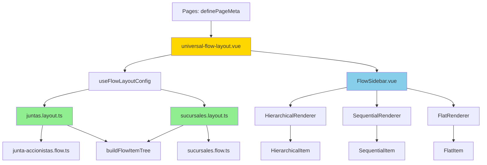

# ✅ Archivos Activos del Sistema de Sidebar Universal

**Fecha:** 4 de Noviembre, 2025  
**Propósito:** Listar todos los archivos que componen el sistema funcionando  
**Total:** 16 archivos activos (2,381 líneas de código)

---

## 📂 Estructura Completa del Sistema

### Types Layer (5 archivos, 685 líneas)

```
app/types/flow-layout/
├─ sidebar-config.ts          ✅ 192 líneas
│  └─ Define: SidebarConfig, FilterConfig, VisibilityRule
│
├─ flow-layout-config.ts      ✅ 287 líneas
│  └─ Define: FlowLayoutConfig, PersistenceOptions, ValidationOptions
│
├─ renderer-types.ts          ✅ 70 líneas
│  └─ Define: Interfaces para renderers
│
├─ navigation-types.ts        ✅ 48 líneas
│  └─ Define: Tipos de navegación
│
└─ index.ts                   ✅ 88 líneas
   └─ Exports centralizados
```

**Responsabilidad:** Definir estructura de datos del sistema

---

### Components Layer (9 archivos, 1,788 líneas)

```
app/components/flow-layout/
│
├─ FlowSidebar.vue            ✅ 425 líneas
│  └─ Componente universal de sidebar adaptable
│
└─ renderers/
   ├─ HierarchicalRenderer.vue ✅ 51 líneas
   │  └─ Renderiza árbol colapsable
   │
   ├─ SequentialRenderer.vue   ✅ 49 líneas
   │  └─ Renderiza lista numerada (wizard)
   │
   ├─ FlatRenderer.vue         ✅ 47 líneas
   │  └─ Renderiza lista simple
   │
   ├─ DefaultRenderer.vue      ✅ 108 líneas
   │  └─ Fallback con debug info
   │
   └─ items/
      ├─ HierarchicalItem.vue  ✅ 189 líneas
      │  └─ Item recursivo con expand/collapse
      │
      ├─ SequentialItem.vue    ✅ 181 líneas
      │  └─ Item numerado con estado
      │
      └─ FlatItem.vue          ✅ 120 líneas
         └─ Item simple
```

**Responsabilidad:** Renderizar sidebars según configuración

---

### Layout Layer (1 archivo, 370 líneas)

```
app/layouts/
└─ universal-flow-layout.vue  ✅ 370 líneas
   └─ Orquestador principal del sistema
```

**Responsabilidad:** 
- Ensamblar sidebars dinámicamente
- Evaluar visibilityRules
- Detectar currentItem
- Renderizar contenido central

**Modificado con:**
- ✅ Debugging logs agregados
- ✅ Fix: buscar en flowTree (no en array flat)
- ✅ Import de buildFlowItemTree y findItemByRoute

---

### Config Layer (2 archivos, 183 líneas)

```
app/config/flows/
│
├─ juntas.layout.ts           ✅ 95 líneas
│  └─ Configuración para Juntas (3 sidebars)
│     ├─ mainSidebar (left, hierarchical, nivel 0-2)
│     └─ stepsSidebar (right, sequential, nivel 3-4, condicional)
│
└─ sucursales.layout.ts       ✅ 88 líneas
   └─ Configuración para Sucursales (2 sidebars)
      └─ mainSidebar (left, flat, todos los niveles)
```

**Responsabilidad:** Configuraciones específicas de cada flujo

**Modificado:**
- ✅ Fix: visibilityRule cambiado de "property" a "custom" en juntas.layout.ts

---

### FlowConfigs (2 archivos)

```
app/config/flows/
│
├─ junta-accionistas.flow.ts  ✅ ~200 líneas (estimado)
│  └─ FlowConfig con items de nivel 0-4
│
└─ sucursales.flow.ts         ✅ ~100 líneas (estimado)
   └─ FlowConfig con 6 items flat
```

**Responsabilidad:** Definición de items del flujo

---

### Composables (1 archivo, 74 líneas)

```
app/composables/
└─ useFlowLayoutConfig.ts     ✅ 74 líneas
   └─ Detecta ruta y retorna layout config correcto
```

**Responsabilidad:** Mapeo de rutas a configuraciones

---

### Utils (1 archivo, ~160 líneas estimado)

```
app/utils/
└─ flowHelpers.ts             ✅ ~160 líneas
   ├─ buildFlowItemTree()      ← Construye árbol desde array flat
   ├─ findItemByRoute()        ← Busca item por ruta (recursivo)
   └─ calculateFlowProgress()  ← Calcula progreso
```

**Responsabilidad:** Helpers para trabajar con FlowItems

---

## 📊 Resumen por Capa

| Capa | Carpeta | Archivos | Líneas | Estado |
|------|---------|----------|--------|--------|
| Types | types/flow-layout/ | 5 | 685 | ✅ Completo |
| Components | components/flow-layout/ | 9 | 1,788 | ✅ Completo |
| Layout | layouts/ | 1 | 370 | ✅ Completo + Debugging |
| Config | config/flows/ | 4 | ~483 | ✅ Completo + Fix |
| Composables | composables/ | 1 | 74 | ✅ Completo |
| Utils | utils/ | 1 | ~160 | ✅ Completo |
| **TOTAL** | - | **21** | **~3,560** | **✅ Sistema Completo** |

---

## 🎯 Dependencias Entre Archivos



---

## 🔧 Archivos Modificados HOY

### 1. universal-flow-layout.vue ✏️

**Cambios:**
- ✅ Agregados debugging logs
- ✅ Import de `buildFlowItemTree` y `findItemByRoute`
- ✅ Nuevo computed `flowTree`
- ✅ Reescrito `currentItem` para usar `findItemByRoute`

**Líneas modificadas:** ~60 líneas

---

### 2. juntas.layout.ts ✏️

**Cambios:**
- ✅ Fix: `visibilityRule.type` cambiado de "property" a "custom"
- ✅ Agregados debugging logs en función custom

**Líneas modificadas:** ~10 líneas

---

## 📝 Archivos de Documentación Creados HOY

```
docs/issues/sidebar-estudio/
├─ ANALISIS-COMPLETO-ESTADO-ACTUAL.md        ✅ Análisis del proyecto
├─ PLAN-DOCUMENTACION-SIDEBAR-FLUJOS.md      ✅ Plan de docs futuras
├─ INDEX-MIREY-ANALISIS.md                   ✅ Índice maestro
├─ OPINION-CRITICA-Y-RECOMENDACIONES-MIREY.md ✅ Opinión honesta
├─ INSTRUCCIONES-TESTING-FASE-1.md           ✅ Guía de testing
├─ DIAGNOSTICO-PROBLEMA-ENCONTRADO.md        ✅ Diagnóstico técnico
├─ ARCHIVOS-DUPLICADOS-Y-OBSOLETOS.md        ✅ Este archivo
└─ ARCHIVOS-ACTIVOS-SISTEMA-SIDEBAR.md       ✅ Lista de archivos en uso
```

**Total:** 8 documentos nuevos de análisis y diagnóstico

---

## ✅ Checklist de Archivos Activos

### Archivos Core (Obligatorios)

- [x] `types/flow-layout/*.ts` (5 archivos)
- [x] `components/flow-layout/FlowSidebar.vue`
- [x] `components/flow-layout/renderers/*.vue` (4 renderers)
- [x] `components/flow-layout/renderers/items/*.vue` (3 items)
- [x] `layouts/universal-flow-layout.vue`
- [x] `composables/useFlowLayoutConfig.ts`
- [x] `utils/flowHelpers.ts`

### Archivos de Configuración (Por Flujo)

**Juntas:**
- [x] `config/flows/junta-accionistas.flow.ts`
- [x] `config/flows/juntas.layout.ts`
- [x] `types/flows/junta-accionistas/` (60+ archivos de FlowItems)
- [x] `config/routes/junta-accionistas.routes.ts`

**Sucursales:**
- [x] `config/flows/sucursales.flow.ts`
- [x] `config/flows/sucursales.layout.ts`
- [x] `types/flows/sucursales/` (~6 archivos de FlowItems)
- [x] `config/routes/sucursales.routes.ts`

### Páginas Migradas

**Juntas:**
- [x] `pages/operaciones/junta-accionistas/**/*.vue` (54 páginas)

**Sucursales:**
- [x] `pages/registro-societario/sucursales/**/*.vue` (7 páginas)

---

## 🎯 Estado del Sistema

| Componente | Archivos | Estado | Notas |
|------------|----------|--------|-------|
| Types | 5 | ✅ | 100% completo |
| Components | 9 | ✅ | 100% completo |
| Layout | 1 | ✅ | Modificado con fixes |
| Configs | 4 | ✅ | Modificado con fixes |
| Composables | 1 | ✅ | 100% completo |
| Utils | 1 | ✅ | 100% completo |
| FlowItems | 66+ | ✅ | Todos definidos |
| Páginas | 61 | ✅ | Todas migradas |

**Total: 147+ archivos activos en el sistema**

---

## 🚀 Próximos Pasos

1. ✅ Fixes aplicados (Fase 2) - COMPLETADO
2. ⏳ Testing en navegador (Fase 1.4) - SIGUIENTE
3. ⏳ Validar que funciona
4. ⏳ Eliminar logs de debugging
5. ⏳ Limpieza de archivos duplicados
6. ⏳ Crear UI de testing
7. ⏳ Documentación final

---

**Documento creado:** 4 de Noviembre, 2025  
**Archivos activos identificados:** 21 archivos core + 126 archivos de config/pages  
**Sistema:** ✅ Listo para testing con fixes aplicados

