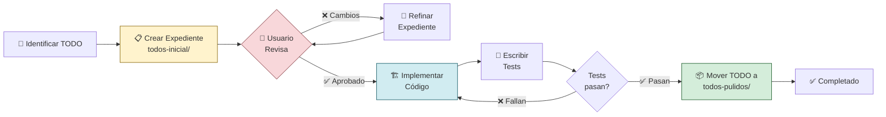

# 🏗️ FILOSOFÍA DEL PROYECTO: "El Expediente Técnico de la Casa"

**Fecha:** 2 de Noviembre, 2025  
**Proyecto:** Sistema Universal de Sidebars

---

## 🎯 Concepto Central

En construcción, **primero se crea el expediente técnico completo** (planos, materiales, permisos, decisiones) y **DESPUÉS se construye la casa**.

En programación tradicional, muchas veces se hace al revés: se programa y luego se documenta (o nunca se documenta 😅).

**Nosotros lo hacemos como los arquitectos:** expediente técnico primero, construcción después.

---

## 📋 Expediente Técnico vs Casa Construida

### **📋 `todos-inicial/` = EXPEDIENTE TÉCNICO COMPLETO**

```
Contiene SOLO DOCUMENTACIÓN (.md files):

├─ 📐 Planos arquitectónicos
│  └─ .roadmap.md (decisiones + arquitectura + issues)
│
├─ 📄 Especificaciones técnicas
│  └─ .documentation.md (objetivo + solución + implementación)
│
├─ 🧱 Lista de materiales
│  ├─ .variables.md (objetos, constantes)
│  └─ .types.md (interfaces TypeScript)
│
├─ ⚙️ Instrucciones de construcción
│  ├─ .functions.md (funciones, helpers)
│  └─ .examples.md (ejemplos de uso)
│
└─ ✅ Aprobaciones y permisos
   └─ Usuario aprueba expediente antes de construir
```

**Fase:** Diseño y Planificación  
**Output:** Documentos .md  
**Criterio de salida:** Usuario dice "✅ Aprobado, construye"

---

### **🏠 `todos-pulidos/` = CASA CONSTRUIDA Y FUNCIONANDO**

```
Contiene DOCUMENTACIÓN + CÓDIGO FUNCIONANDO:

├─ 📋 Expediente original (referencia)
│  ├─ .roadmap.md
│  ├─ .documentation.md
│  ├─ .variables.md
│  └─ .types.md
│
├─ 💻 Código TypeScript/Vue implementado
│  ├─ app/types/flow-system/*.ts
│  ├─ app/composables/*.ts
│  └─ app/components/*.vue
│
├─ 🧪 Tests completos y pasando
│  ├─ *.test.ts (>90% coverage)
│  └─ *.spec.ts
│
└─ ✅ Validaciones OK
   ├─ npm run type-check ✅
   ├─ npm run lint ✅
   └─ npm run test ✅
```

**Fase:** Construcción y Validación  
**Output:** Código funcional + tests  
**Criterio de entrada:** Expediente aprobado  
**Criterio de salida:** Todo funciona y está probado

---

## 🔄 Flujo Completo



---

## ⚡ Diferencias Clave

| Aspecto              | Antes (común)           | Ahora (nuestra metodología)     |
| -------------------- | ----------------------- | ------------------------------- |
| **Orden**            | Código → Docs (a veces) | Docs → Código (siempre)         |
| **Aprobación**       | Después de programar    | Antes de programar              |
| **Cambios**          | Refactorizar código     | Refinar expediente (más barato) |
| **Tests**            | Opcional                | Obligatorio (>90% coverage)     |
| **Mover a pulidos/** | Cuando se quiera        | Solo con tests pasando          |
| **Documentación**    | Desactualizada          | Siempre sincronizada            |

---

## 🎯 Ventajas de este Enfoque

### **1. Detectar Problemas Temprano**

❌ **Antes:** Programo 3 días → descubro arquitectura incorrecta → refactorizo 2 días más  
✅ **Ahora:** Diseño 3 horas → usuario detecta problema → ajusto expediente en 1 hora

### **2. Claridad Total**

❌ **Antes:** "¿Qué hace este código?"  
✅ **Ahora:** Lees el expediente técnico y entiendes TODO

### **3. Aprobaciones Explícitas**

❌ **Antes:** Programo y asumo que está bien  
✅ **Ahora:** Usuario aprueba ANTES de programar

### **4. Menos Refactorización**

❌ **Antes:** Cambiar arquitectura = reescribir código  
✅ **Ahora:** Cambiar arquitectura = editar .md (mucho más rápido)

### **5. Documentación Viva**

❌ **Antes:** Docs desactualizados o inexistentes  
✅ **Ahora:** Docs son la fuente de verdad, código refleja docs

---

## 🚨 Reglas de Oro

```
1. ❌ NO escribir código sin expediente aprobado
   └─ "Si no está en el expediente, no existe"

2. ❌ NO mover a todos-pulidos/ sin tests
   └─ "Sin tests = no está terminado"

3. ❌ NO avanzar sin completar TODO anterior
   └─ "Respetar dependencias = menos bugs"

4. ❌ NO improvisar durante implementación
   └─ "Seguir el expediente paso a paso"

5. ✅ Iterar en expediente hasta que esté perfecto
   └─ "1 hora documentando ahorra 10 horas programando"
```

---

## 📊 Checklist para Mover a `todos-pulidos/`

```markdown
TODO-XXX: [Nombre del TODO]

EXPEDIENTE TÉCNICO:

- [ ] ✅ .roadmap.md completo (decisiones + arquitectura)
- [ ] ✅ .documentation.md completo (diseño técnico)
- [ ] ✅ .variables.md (si aplica)
- [ ] ✅ .types.md (si aplica)
- [ ] ✅ Usuario aprobó expediente

IMPLEMENTACIÓN:

- [ ] 💻 Código TypeScript/Vue implementado
- [ ] 🧪 Tests unitarios escritos
- [ ] 🧪 Tests de integración escritos
- [ ] ✅ Coverage >90%
- [ ] ✅ Todos los tests pasan

VALIDACIONES:

- [ ] ✅ npm run type-check (sin errores)
- [ ] ✅ npm run lint (sin warnings)
- [ ] ✅ npm run test (todos pasan)
- [ ] ✅ Probado manualmente en navegador
- [ ] ✅ Usuario valida funcionamiento

INTEGRACIÓN:

- [ ] 🔗 Integrado con stores/composables/components
- [ ] 📖 README actualizado (si aplica)
- [ ] 🏷️ ROADMAP.md actualizado

→ Si TODO cumple TODOS los checkboxes: MOVER a todos-pulidos/
```

---

## 🎓 Ejemplo: TODO-001 (Estado Actual)

### **Fase 1: Expediente Técnico (✅ COMPLETO)**

```
todos-inicial/todo-001-estructura-datos.*

✅ .roadmap.md (650 líneas)
   └─ 3 decisiones arquitectónicas resueltas

✅ .documentation.md (800 líneas)
   └─ Diseño técnico completo con diagramas

✅ .variables-flowItem.md (1000+ líneas)
   └─ 37+ FlowItems documentados

✅ .variables-flowConfig.md (600 líneas)
   └─ 3 FlowConfigs completos

✅ .types.md (1200+ líneas)
   └─ Interfaces + Zod + Helpers documentados

✅ Usuario aprobó expediente
```

**Estado:** 📋 Expediente Aprobado → Listo para Fase 2

---

### **Fase 2: Construcción (⏳ PENDIENTE)**

```
app/types/flow-system/

⬜ identity.ts (FlowItemIdentity)
⬜ hierarchy.ts (FlowItemHierarchy)
⬜ navigation.ts (FlowItemNavigation)
⬜ behavior.ts (FlowItemBehavior)
⬜ right-sidebar.ts (FlowItemRightSidebar)
⬜ validation.ts (FlowItemValidation)
⬜ flow-item.ts (FlowItem entity)
⬜ flow-config.ts (FlowConfig entity)
⬜ schemas.ts (Zod validators)
⬜ helpers.ts (flattenFlowItems, findById, etc.)
⬜ type-guards.ts (isFlowItem, etc.)
⬜ index.ts (exports)

app/types/flow-system/__tests__/

⬜ schemas.test.ts
⬜ helpers.test.ts
⬜ type-guards.test.ts
```

**Siguiente Paso:** Implementar código siguiendo el expediente paso a paso

---

### **Fase 3: Pulido (⏳ FUTURO)**

Cuando se complete la Fase 2:

```
1. Validar tests (npm run test)
2. Validar TypeScript (npm run type-check)
3. Validar linter (npm run lint)
4. Usuario valida funcionamiento
5. Mover TODO-001 completo a todos-pulidos/
6. Actualizar ROADMAP.md: Estado = ✅ Completado
```

---

## 💡 Analogía Final

```
🏗️ Construcción de Casa

1. EXPEDIENTE TÉCNICO (todos-inicial/)
   ├─ Arquitecto diseña planos
   ├─ Ingeniero calcula estructuras
   ├─ Se obtienen permisos
   ├─ Cliente aprueba diseño ✅
   └─ TOTAL: 2 semanas

2. CONSTRUCCIÓN (implementación)
   ├─ Constructores siguen planos
   ├─ Inspector valida cada etapa
   ├─ Pruebas de resistencia
   └─ TOTAL: 6 meses

3. ENTREGA (todos-pulidos/)
   ├─ Casa lista para habitar
   ├─ Todos los sistemas funcionando
   ├─ Cliente hace inspección final ✅
   └─ Se entregan llaves

→ Si cambias de opinión en FASE 1: Modificas planos (barato)
→ Si cambias de opinión en FASE 2: Demoler y reconstruir (caro)

MORALEJA: Invierte tiempo en el expediente técnico,
         te ahorrará 10x ese tiempo en código.
```

---

## ✅ Resumen Ejecutivo

| Fase             | Ubicación        | Contenido        | Aprobación      | Output             |
| ---------------- | ---------------- | ---------------- | --------------- | ------------------ |
| **Diseño**       | `todos-inicial/` | Solo .md         | Usuario aprueba | Expediente técnico |
| **Construcción** | (workspace)      | .ts, .vue, tests | Tests pasan     | Código funcional   |
| **Pulido**       | `todos-pulidos/` | .md + código     | Usuario valida  | TODO completo      |

**Filosofía:** Expediente primero, código después, pulir solo cuando funciona.

---

**🏗️ "En la construcción, los planos se hacen antes que la casa.  
En programación, debería ser igual."**
