# 🚀 Flow System: Metodología de Trabajo Modular

## 📋 Información del Proyecto

**Proyecto:** Sistema Universal de Sidebars para ProBO v3  
**Rama:** `feat/crear-config-para-navegacion-sidebar`  
**Fecha Inicio:** 31 de Octubre, 2025  
**Última Actualización:** 2 de Noviembre, 2025  
**Estado:** ✅ Metodología Definida - Listo para Desarrollo

---

## 🎯 Objetivo Principal

Crear un **sistema de sidebar universal** que:

1. ✅ Recibe un array de objetos (FlowItems)
2. ✅ Se monta automáticamente (sin configuración manual)
3. ✅ Funciona la navegación (Anterior/Siguiente)
4. ✅ Basado en DDD Hexagonal (separación de capas)
5. ✅ Type-safe (TypeScript completo)
6. ✅ Reutilizable (cualquier flujo: registro, sucursales, juntas)

---

## 🔄 Metodología: Sistema Modular de TODOs

### **🏗️ Filosofía: "El Expediente Técnico de la Casa"**

En construcción, primero se crea el **expediente técnico completo** (planos, materiales, permisos) y DESPUÉS se construye la casa. Aquí hacemos exactamente lo mismo:

```
📋 todos-inicial/  = EXPEDIENTE TÉCNICO COMPLETO
                     │
                     ├─ 📐 Planos arquitectónicos (roadmap.md)
                     ├─ 📄 Especificaciones técnicas (documentation.md)
                     ├─ 🧱 Lista de materiales (variables.md, types.md)
                     ├─ ✅ Decisiones de diseño (aprobadas por usuario)
                     └─ 📅 Cronograma de implementación

🏠 todos-pulidos/   = CASA CONSTRUIDA Y FUNCIONANDO
                     │
                     ├─ 💻 Código implementado (.ts, .vue files)
                     ├─ 🧪 Tests pasando (>90% coverage)
                     ├─ 🔗 Integrado con el sistema
                     ├─ 📊 Validado en staging/producción
                     └─ ✅ Aprobado y en uso
```

**⚠️ Regla de Oro:** NO se escribe código hasta que el expediente técnico (todos-inicial/) esté 100% aprobado por el usuario.

---

### **Flujo de Trabajo Completo**

```mermaid
graph TD
    A[📊 ROADMAP.md] --> B[🎯 Identificar TODO]
    B --> C[📋 Crear EXPEDIENTE en todos-inicial/]

    C --> D[📝 .roadmap.md<br/>Decisiones + Arquitectura]
    C --> E[📖 .documentation.md<br/>Explicación técnica]
    C --> F[🔧 .variables.md<br/>Objetos completos]
    C --> G[⚙️ .types.md<br/>Tipos TypeScript]

    D --> H{👤 Usuario<br/>Revisa Expediente}
    E --> H
    F --> H
    G --> H

    H -->|❌ Cambios| I[🔄 Iterar en todos-inicial/<br/>Refinar expediente]
    I --> H

    H -->|✅ Expediente Aprobado| J[🏗️ FASE CONSTRUCCIÓN]

    J --> K[💻 Implementar código<br/>Crear archivos .ts/.vue]
    K --> L[🧪 Escribir tests<br/>Unit + Integration]
    L --> M{Tests pasan<br/>>90% coverage?}

    M -->|❌ Fallan| K
    M -->|✅ Pasan| N[📦 Mover TODO completo<br/>a todos-pulidos/]

    N --> O[📊 Actualizar ROADMAP.md<br/>Marcar como ✅]
    O --> P[✅ TODO Completo<br/>Casa lista para habitar]

    style C fill:#fff3cd,stroke:#856404,stroke-width:3px
    style J fill:#d1ecf1,stroke:#0c5460,stroke-width:3px
    style N fill:#d4edda,stroke:#155724,stroke-width:3px
    style H fill:#f8d7da,stroke:#721c24,stroke-width:2px
```



---

## 📁 Estructura de Carpetas

```
sidebar-estudio/
│
├── 📄 README.md ────────────────► Este archivo (Metodología)
├── 📄 ROADMAP.md ───────────────► Roadmap General (Tabla Maestra)
│
├── 📂 config/ ──────────────────► Documentación teórica (referencias)
│   ├── 1_FLOW_SYSTEM_EXPLICACION.md
│   ├── 2_FLOW_SYSTEM_CONSTRUCCION_PASO_A_PASO.md
│   └── ...
│
├── 📂 variables/ ───────────────► Objetos base del sistema
│   ├── flow-objects.md
│   └── ...
│
├── 📂 todos-inicial/ ───────────► � EXPEDIENTES TÉCNICOS (Planos completos)
│   │                               ↓ TODO en Documentación
│   ├── todo-001-estructura-datos.roadmap.md
│   ├── todo-001-estructura-datos.documentation.md
│   ├── todo-001-estructura-datos.variables-flowItem.md
│   ├── todo-001-estructura-datos.variables-flowConfig.md
│   ├── todo-001-estructura-datos.types.md
│   │                               ↓ TODO Aprobado → Construir
│   ├── todo-002-arquitectura-capas.roadmap.md
│   └── ...
│
└── 📂 todos-pulidos/ ───────────► 🏠 CASAS CONSTRUIDAS (Código funcionando)
    │                               ↓ TODO Completado (código + tests)
    ├── todo-001-estructura-datos.roadmap.md ──┐
    ├── todo-001-estructura-datos.documentation.md ├─► Expediente original
    ├── todo-001-estructura-datos.variables-flowItem.md │  (para referencia)
    ├── todo-001-estructura-datos.variables-flowConfig.md │
    └── todo-001-estructura-datos.types.md ────┘
```

### **Diferencia Clave:**

- **`todos-inicial/`** = Solo documentación (markdown). El TODO está en fase de "diseño/planos"
- **`todos-pulidos/`** = Documentación + Código implementado + Tests. El TODO está "construido y funcionando"

### **¿Cuándo mover a `todos-pulidos/`?**

Solo cuando:

1. ✅ Expediente aprobado por usuario
2. ✅ Código TypeScript/Vue implementado
3. ✅ Tests escritos y pasando (>90% coverage)
4. ✅ Integrado con el sistema
5. ✅ Validado que funciona correctamente

---

## 📝 Sistema de Archivos por TODO

### **1. Archivos Obligatorios** (Siempre se crean)

\`\`\`
todo-{número}-{nombre}.roadmap.md ← Decisiones + Arquitectura + Issues
todo-{número}-{nombre}.documentation.md ← Explicación técnica completa
\`\`\`

#### **Ejemplo:**

\`\`\`
todo-001-estructura-datos.roadmap.md
todo-001-estructura-datos.documentation.md
\`\`\`

---

### **2. Archivos Opcionales** (Según necesidad del TODO)

\`\`\`
todo-{número}-{nombre}.variables.md ← Objetos/Constantes
todo-{número}-{nombre}.functions.md ← Funciones/Métodos
todo-{número}-{nombre}.types.md ← Tipos TypeScript
todo-{número}-{nombre}.examples.md ← Ejemplos de código
todo-{número}-{nombre}.tests.md ← Casos de prueba
todo-{número}-{nombre}.api.md ← Especificación de API
\`\`\`

---

### **3. Archivos Específicos** (Cuando un archivo es muy grande)

\`\`\`
todo-{número}-{nombre}.{tipo}-{subtipo}.md

Ejemplos:
todo-001-estructura-datos.variables-flowItem.md
todo-001-estructura-datos.variables-flowConfig.md
todo-001-estructura-datos.types-identity.md
todo-001-estructura-datos.types-hierarchy.md
\`\`\`

---

### **4. Roadmaps Específicos** (Para secciones complejas)

\`\`\`
todo-{número}-{nombre}.{tipo}.roadmap.md

Ejemplos:
todo-001-estructura-datos.variables.roadmap.md
todo-001-estructura-datos.functions.roadmap.md
\`\`\`

---

## 📋 Contenido de Cada Archivo

### **A. \`todo-XXX-nombre.roadmap.md\`**

Estructura:

1. 🎯 DECISIONES (¿Qué debemos decidir?)
2. 🏗️ ARQUITECTURA (¿Cómo se integra?)
3. 📋 ISSUES (¿Qué tareas hay?)
4. ⏱️ ESTIMACIÓN (Tiempo, complejidad, prioridad)
5. 🔗 DEPENDENCIAS (Requiere/Bloquea otros TODOs)

---

### **B. \`todo-XXX-nombre.documentation.md\`**

Estructura:

1. 🎯 Objetivo
2. 📚 Contexto
3. 💡 Solución Propuesta
4. 💻 Implementación
5. ✅ Criterios de Aceptación
6. 🧪 Testing
7. 📖 Referencias

---

### **C. \`todo-XXX-nombre.variables.md\`**

Contiene objetos/constantes TypeScript completos con descripción y uso.

---

### **D. \`todo-XXX-nombre.functions.md\`**

Contiene funciones/métodos con firma, descripción, parámetros, retorno y ejemplos.

---

## 🔄 Proceso de Trabajo

### **Fase 1: 📋 Crear Expediente Técnico (todos-inicial/)**

**Objetivo:** Documentar TODO ANTES de escribir código

1. **Crear archivos base:**

   - `todo-XXX-nombre.roadmap.md` (Decisiones + Arquitectura)
   - `todo-XXX-nombre.documentation.md` (Explicación técnica)

2. **Crear archivos opcionales** (según necesidad):

   - `.variables.md` (Objetos/Constantes)
   - `.types.md` (Tipos TypeScript)
   - `.functions.md` (Funciones/Helpers)
   - `.examples.md` (Ejemplos de código)
   - `.tests.md` (Plan de testing)

3. **Documentar decisiones:**

   - Presentar opciones (A, B, C)
   - Pros/contras de cada opción
   - Recomendar solución
   - Esperar aprobación de usuario

4. **Iterar hasta aprobación:**
   - Usuario revisa expediente
   - Sugiere cambios
   - AI refina documentación
   - Repetir hasta que usuario diga: ✅ "Aprobado, implementa"

**⚠️ IMPORTANTE:** El TODO permanece en `todos-inicial/` hasta que el código esté implementado y funcionando.

---

### **Fase 2: 🏗️ Construir (Implementar Código)**

**Objetivo:** Convertir el expediente en código real

1. **Implementar según roadmap:**

   - Seguir el roadmap.md paso a paso
   - Crear archivos TypeScript/Vue
   - Implementar todas las funciones documentadas

2. **Escribir tests:**

   - Tests unitarios (>80% coverage mínimo)
   - Tests de integración
   - Validar todos los criterios de aceptación

3. **Integrar con sistema:**
   - Conectar con stores existentes
   - Integrar con componentes
   - Probar en la aplicación real

**⚠️ CLAVE:** Si durante la implementación descubres que algo del expediente no funciona, VUELVES a `todos-inicial/`, actualizas el expediente, y lo vuelves a aprobar.

---

### **Fase 3: 🏠 Pulir (Mover a todos-pulidos/)**

**Objetivo:** Validar que todo funciona y mover a "casas construidas"

**Checklist antes de mover:**

- [ ] ✅ Código implementado y funcionando
- [ ] ✅ Tests escritos y pasando (>90% coverage)
- [ ] ✅ TypeScript sin errores (`npm run type-check`)
- [ ] ✅ Linter sin warnings (`npm run lint`)
- [ ] ✅ Integrado con el sistema
- [ ] ✅ Probado manualmente en navegador
- [ ] ✅ Usuario valida que cumple objetivos
- [ ] ✅ Documentación actualizada (si hubo cambios)

**Solo cuando TODO está ✅ arriba:**

```bash
# Mover TODO completo a pulidos
mv todos-inicial/todo-XXX-* todos-pulidos/
```

**Actualizar ROADMAP.md:**

```markdown
| 001 | Estructura de Datos | ✅ | ✅ | ✅ | ✅ | ✅ | ✅ | ✅ Completado | 🔥 Alta |
```

---

## 💬 Roles y Responsabilidades

### **👤 Usuario (Tú)**

- 🎯 Definir objetivos
- 🔍 Revisar propuestas
- ✅ Aprobar decisiones
- 🚀 Priorizar TODOs

### **🤖 AI (Yo)**

- 📝 Documentar TODOs
- 🏗️ Proponer arquitectura
- 💻 Implementar código
- 🔧 Ajustar según feedback

---

## 📊 Convenciones de Nombres

### **Formato:**

\`\`\`
todo-{número:3dígitos}-{nombre-descriptivo}.{tipo}.md
\`\`\`

### **Ejemplos:**

\`\`\`
✅ todo-001-estructura-datos.roadmap.md
✅ todo-001-estructura-datos.documentation.md
✅ todo-001-estructura-datos.variables-flowItem.md
✅ todo-002-store-pinia.functions-actions.md
\`\`\`

### **Tipos:**

- \`roadmap\` - Decisiones + Arquitectura + Issues
- \`documentation\` - Explicación técnica
- \`variables\` - Objetos/Constantes
- \`functions\` - Funciones/Métodos
- \`types\` - Tipos TypeScript
- \`examples\` - Ejemplos de código
- \`tests\` - Casos de prueba
- \`api\` - Especificación de API

---

## 💡 Principios del Sistema

1. **📋 EXPEDIENTE PRIMERO, CÓDIGO DESPUÉS**

   - Jamás escribir código sin expediente técnico aprobado
   - El expediente es la "fuente de verdad"
   - Si el expediente cambia, el código debe cambiar

2. **🏗️ CONSTRUCCIÓN SECUENCIAL**

   - Un TODO a la vez
   - No avanzar al siguiente sin completar el actual
   - Cada TODO bloquea dependencias claramente

3. **✅ APROBACIÓN EXPLÍCITA**

   - Usuario debe aprobar expediente antes de implementar
   - Usuario debe validar código antes de marcar completo
   - Sin aprobación = no se avanza

4. **🔄 ITERACIÓN CONSTANTE**

   - Proponer → Revisar → Refinar → Aprobar
   - Está bien volver atrás y actualizar el expediente
   - La documentación evoluciona con el proyecto

5. **📊 MODULARIDAD EXTREMA**

   - Cada TODO es independiente
   - Archivos pequeños y enfocados
   - Fácil de revisar, fácil de modificar

6. **🧪 TESTS = GARANTÍA DE CALIDAD**

   - > 90% coverage obligatorio para mover a todos-pulidos/
   - Tests prueban criterios de aceptación
   - Sin tests = no está completo

7. **📖 CLARIDAD SOBRE VELOCIDAD**
   - Mejor documentar bien que rápido
   - Nombres descriptivos, no crípticos
   - Código que se auto-documenta

---

## 🎯 Estado Actual

| Fase               | Estado | Descripción                 |
| ------------------ | ------ | --------------------------- |
| 📚 Metodología     | ✅     | Sistema modular documentado |
| 📋 ROADMAP General | 🟡     | En actualización            |
| 📂 Estructura      | 🟡     | Carpetas por crear          |
| 📝 TODO-001        | ⏳     | Por iniciar                 |

---

## 🚀 Próximos Pasos

1. ✅ Actualizar ROADMAP.md como tabla maestra
2. ✅ Crear carpetas todos-inicial/ y todos-pulidos/
3. ✅ Crear TODO-001 completo
4. ⏳ Pulir y aprobar TODO-001
5. ⏳ Implementar TODO-001

---

**🔥 Sistema 100% modular, extensible y documentado. ¡Listo para crear TODOs!**
