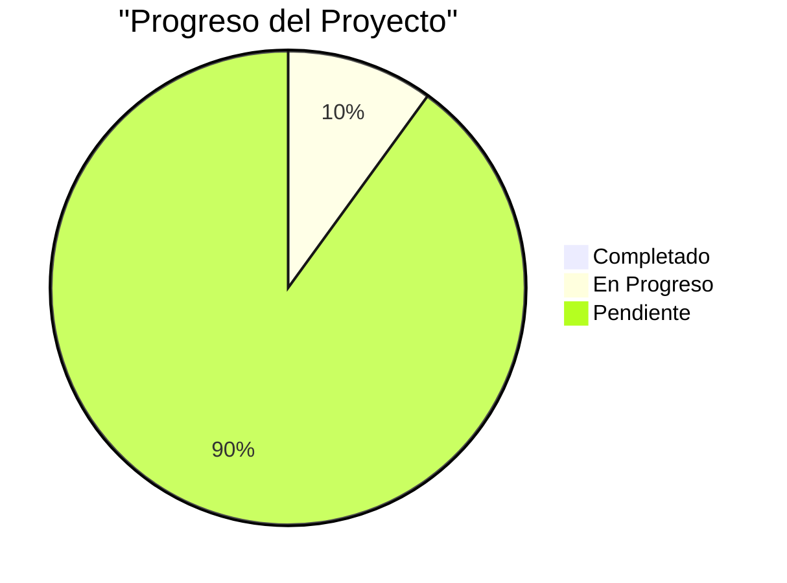
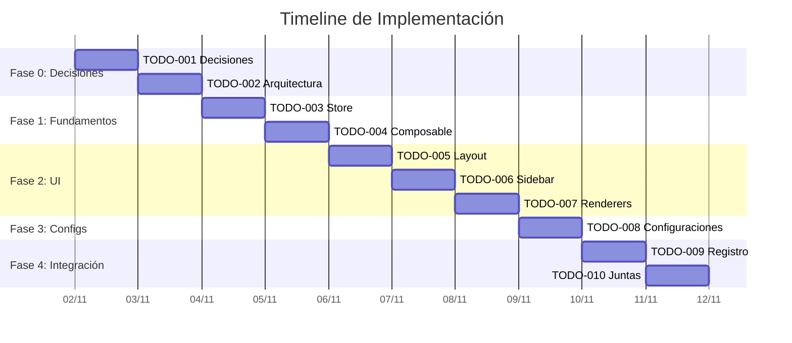

# 🗺️ ROADMAP GENERAL - Flow System Implementation

**Proyecto:** Sistema Universal de Sidebars  
**Rama:** `feat/crear-config-para-navegacion-sidebar`  
**Fecha Inicio:** 31 de Octubre, 2025  
**Última Actualización:** 2 de Noviembre, 2025

---

## 📊 Vista General

Este roadmap es la **tabla maestra** que lista todos los TODOs del proyecto.  
Los detalles técnicos de cada TODO están en sus archivos individuales en `todos-inicial/` o `todos-pulidos/`.

---

## 🎯 Progreso Global



---

## 📋 Tabla Maestra de TODOs

| # | TODO | Roadmap | Docs | Variables | Functions | Types | Código | Estado | Prioridad |
|---|------|---------|------|-----------|-----------|-------|--------|--------|-----------|
| 001 | Estructura de Datos | 🟡 | 🟡 | 🟡 | ⬜ | 🟡 | ⬜ | 🚧 En Progreso | 🔥 Alta |
| 002 | Arquitectura de Capas | ⬜ | ⬜ | ⬜ | ⬜ | ⬜ | ⬜ | ⏳ Pendiente | 🔥 Alta |
| 003 | Store Principal (Pinia) | ⬜ | ⬜ | ⬜ | ⬜ | ⬜ | ⬜ | ⏳ Pendiente | 🔥 Alta |
| 004 | Composable API | ⬜ | ⬜ | ⬜ | ⬜ | ⬜ | ⬜ | ⏳ Pendiente | 🔥 Alta |
| 005 | UniversalFlowLayout | ⬜ | ⬜ | ⬜ | ⬜ | ⬜ | ⬜ | ⏳ Pendiente | 🔥 Alta |
| 006 | FlowSidebar Adaptable | ⬜ | ⬜ | ⬜ | ⬜ | ⬜ | ⬜ | ⏳ Pendiente | 🟡 Media |
| 007 | Renderizadores | ⬜ | ⬜ | ⬜ | ⬜ | ⬜ | ⬜ | ⏳ Pendiente | 🟡 Media |
| 008 | Configuraciones de Flujos | ⬜ | ⬜ | ⬜ | ⬜ | ⬜ | ⬜ | ⏳ Pendiente | 🟡 Media |
| 009 | Integración Registro | ⬜ | ⬜ | ⬜ | ⬜ | ⬜ | ⬜ | ⏳ Pendiente | 🟢 Baja |
| 010 | Integración Juntas | ⬜ | ⬜ | ⬜ | ⬜ | ⬜ | ⬜ | ⏳ Pendiente | 🟢 Baja |

### **Leyenda:**
- ✅ = Completo
- 🟡 = En Progreso
- ⬜ = Pendiente
- ❌ = Bloqueado

### **Estados:**
- ✅ Completado
- 🚧 En Progreso
- ⏳ Pendiente
- 🔴 Bloqueado

### **Prioridades:**
- 🔥 Alta (crítico)
- 🟡 Media (importante)
- 🟢 Baja (puede esperar)

---

## 📑 Detalle de TODOs

### **TODO-001: Estructura de Datos** 🚧

**Ubicación:** `todos-inicial/todo-001-estructura-datos.*`

**Objetivo:** Definir FlowItem y FlowConfig con estructura agrupada

**Archivos:**
- `todo-001-estructura-datos.roadmap.md` (Decisiones + Arquitectura + Issues)
- `todo-001-estructura-datos.documentation.md` (Explicación técnica)
- `todo-001-estructura-datos.variables-flowItem.md` (Objeto FlowItem completo)
- `todo-001-estructura-datos.variables-flowConfig.md` (Objeto FlowConfig completo)
- `todo-001-estructura-datos.types.md` (Tipos TypeScript)

**Dependencias:** Ninguna (es el fundamento)

**Bloquea a:** TODO-002, TODO-003, TODO-004

**Estimación:** 4 horas (1h decisiones + 3h documentación)

**Estado:** 🚧 En Progreso (10%)

---

### **TODO-002: Arquitectura de Capas** ⏳

**Objetivo:** Definir estructura de carpetas y separación de capas DDD Hexagonal

**Dependencias:** TODO-001

**Bloquea a:** TODO-003, TODO-004, TODO-005

**Estimación:** 2 horas

**Estado:** ⏳ Pendiente

---

### **TODO-003: Store Principal (Pinia)** ⏳

**Objetivo:** Implementar useFlowNavigationStore con estado global

**Dependencias:** TODO-001, TODO-002

**Bloquea a:** TODO-004

**Estimación:** 3 horas

**Estado:** ⏳ Pendiente

---

### **TODO-004: Composable API** ⏳

**Objetivo:** Crear useFlowNavigation composable

**Dependencias:** TODO-003

**Bloquea a:** TODO-005

**Estimación:** 2.5 horas

**Estado:** ⏳ Pendiente

---

### **TODO-005: UniversalFlowLayout** ⏳

**Objetivo:** Componente orquestador principal

**Dependencias:** TODO-004

**Bloquea a:** TODO-006, TODO-007

**Estimación:** 3 horas

**Estado:** ⏳ Pendiente

---

### **TODO-006: FlowSidebar Adaptable** ⏳

**Objetivo:** Sidebar que renderiza dinámicamente según configuración

**Dependencias:** TODO-005

**Bloquea a:** TODO-007

**Estimación:** 2.5 horas

**Estado:** ⏳ Pendiente

---

### **TODO-007: Renderizadores** ⏳

**Objetivo:** HierarchicalRenderer + SequentialRenderer + MixedRenderer

**Dependencias:** TODO-006

**Bloquea a:** TODO-008

**Estimación:** 3 horas

**Estado:** ⏳ Pendiente

---

### **TODO-008: Configuraciones de Flujos** ⏳

**Objetivo:** Crear .flow.ts configs (Registro, Sucursales, Juntas)

**Dependencias:** TODO-007

**Bloquea a:** TODO-009, TODO-010

**Estimación:** 4 horas

**Estado:** ⏳ Pendiente

---

### **TODO-009: Integración Registro** ⏳

**Objetivo:** Conectar páginas existentes de Registro con nuevo sistema

**Dependencias:** TODO-008

**Estimación:** 2 horas

**Estado:** ⏳ Pendiente

---

### **TODO-010: Integración Juntas** ⏳

**Objetivo:** Conectar páginas existentes de Juntas con nuevo sistema

**Dependencias:** TODO-008

**Estimación:** 2 horas

**Estado:** ⏳ Pendiente

---

## 📊 Timeline Estimado



---

## 📈 Métricas

### **Tiempo Total Estimado:**
- **Fase 0 (Decisiones):** 6 horas (TODO-001, TODO-002)
- **Fase 1 (Fundamentos):** 5.5 horas (TODO-003, TODO-004)
- **Fase 2 (UI):** 8.5 horas (TODO-005, TODO-006, TODO-007)
- **Fase 3 (Configs):** 4 horas (TODO-008)
- **Fase 4 (Integración):** 4 horas (TODO-009, TODO-010)

**TOTAL:** ~28 horas (~4 días laborales)

### **Progreso:**
```
Completados: 0/10 (0%)
En Progreso: 1/10 (10%)
Pendientes:  9/10 (90%)
```

---

## 🎯 Hitos (Milestones)

| Hito | TODOs Incluidos | Estado | Fecha Objetivo |
|------|-----------------|--------|----------------|
| **M1: Decisiones** | 001-002 | 🟡 10% | 3 Nov 2025 |
| **M2: Fundamentos** | 003-004 | ⬜ 0% | 5 Nov 2025 |
| **M3: UI Completo** | 005-007 | ⬜ 0% | 7 Nov 2025 |
| **M4: Integración** | 008-010 | ⬜ 0% | 8 Nov 2025 |

---

## 🚀 Próxima Acción Inmediata

### **AHORA:**
1. ✅ Completar TODO-001 (Estructura de Datos)
   - Crear 5 archivos en `todos-inicial/`
   - Documentar decisiones
   - Definir FlowItem y FlowConfig

### **DESPUÉS (cuando TODO-001 esté aprobado):**
2. Crear TODO-002 (Arquitectura de Capas)
3. Pulir y aprobar ambos TODOs
4. Mover a `todos-pulidos/`
5. Comenzar implementación

---

## 📝 Notas Importantes

- **NO se avanza** sin completar el TODO anterior
- **Cada TODO** debe estar aprobado antes de implementar código
- **Los detalles técnicos** están en los archivos individuales de cada TODO
- **Este documento** es solo la tabla maestra de progreso

---

## 🔗 Referencias

- [README.md](./README.md) - Metodología de trabajo
- [variables/flow-objects.md](./variables/flow-objects.md) - Objetos base
- [config/](./config/) - Documentación teórica

---

**Última actualización:** 2 de Noviembre, 2025  
**Estado:** 🟡 En Progreso - TODO-001 activo  
**Próximo milestone:** M1 - Decisiones (3 Nov 2025)
