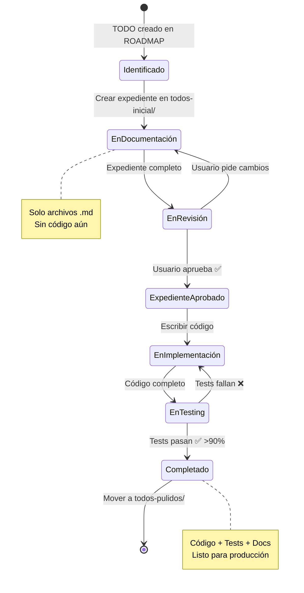
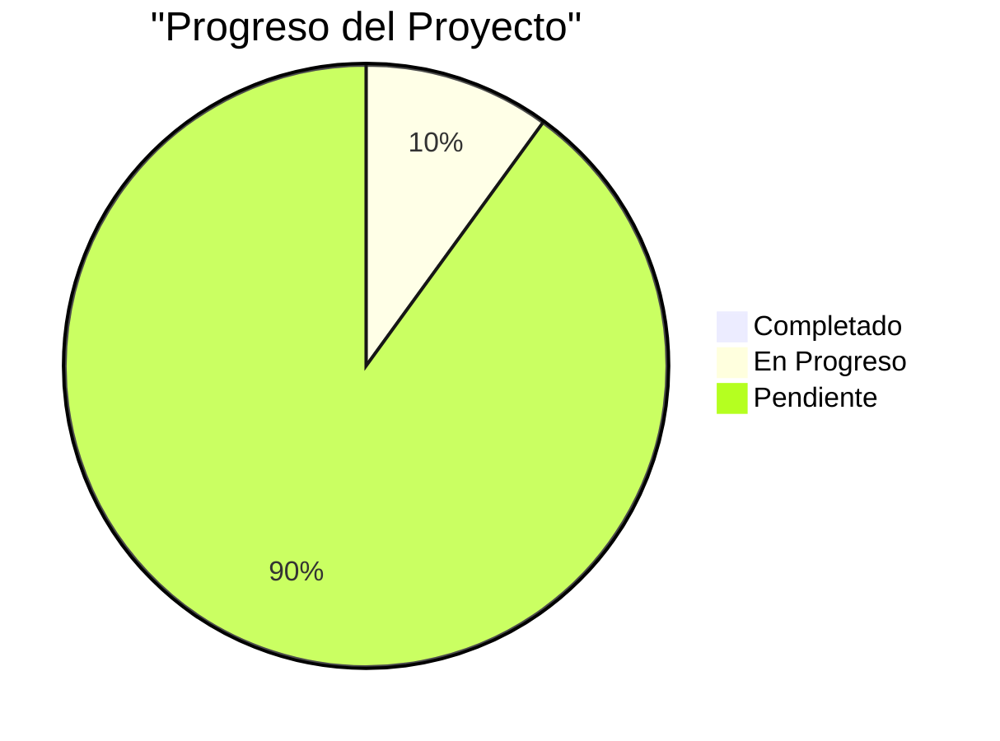
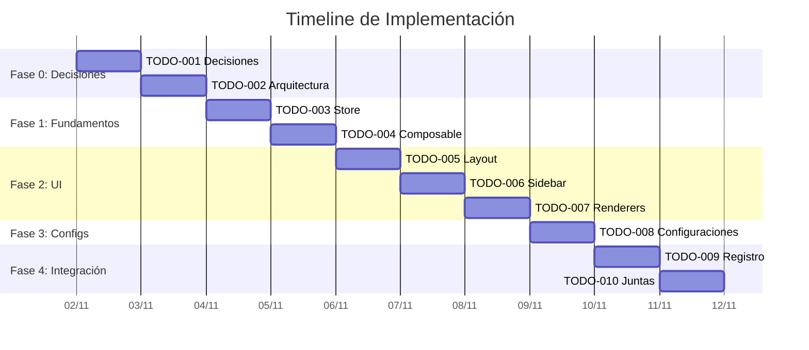
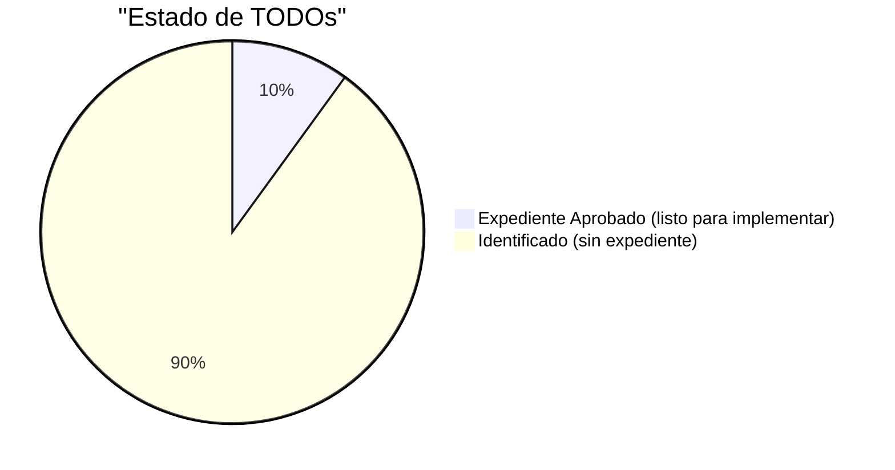

# 🗺️ ROADMAP GENERAL - Flow System Implementation

**Proyecto:** Sistema Universal de Sidebars  
**Rama:** `feat/crear-config-para-navegacion-sidebar`  
**Fecha Inicio:** 31 de Octubre, 2025  
**Última Actualización:** 2 de Noviembre, 2025

---

## 📊 Vista General

Este roadmap es la **tabla maestra** que lista todos los TODOs del proyecto.

### **🏗️ Filosofía:**

```
📋 todos-inicial/  = Expediente técnico (planos, decisiones, materiales)
🏠 todos-pulidos/  = Casa construida (código funcionando + tests)
```

**Los detalles técnicos** de cada TODO están en sus archivos individuales.  
**Este documento** solo rastrea el progreso global.

---

## 🎯 Estados de un TODO



---

## 🎯 Progreso Global



---

## 📋 Tabla Maestra de TODOs

| #       | TODO                                                                       | Roadmap | Docs | Variables | Types | Código | Tests | Estado                 | Ubicación      | Prioridad |
| ------- | -------------------------------------------------------------------------- | ------- | ---- | --------- | ----- | ------ | ----- | ---------------------- | -------------- | --------- |
| **001** | [Estructura de Datos](#todo-001-estructura-de-datos-flowitem-y-flowconfig) | ✅      | ✅   | ✅        | ✅    | ⬜     | ⬜    | 📋 Expediente Aprobado | todos-inicial/ | 🔥 Alta   |
| 002     | Arquitectura de Capas                                                      | ⬜      | ⬜   | ⬜        | ⬜    | ⬜     | ⬜    | 🎯 Identificado        | -              | 🔥 Alta   |
| 003     | Store Principal (Pinia)                                                    | ⬜      | ⬜   | ⬜        | ⬜    | ⬜     | ⬜    | 🎯 Identificado        | -              | 🔥 Alta   |
| 004     | Composable API                                                             | ⬜      | ⬜   | ⬜        | ⬜    | ⬜     | ⬜    | 🎯 Identificado        | -              | 🔥 Alta   |
| 005     | UniversalFlowLayout                                                        | ⬜      | ⬜   | ⬜        | ⬜    | ⬜     | ⬜    | 🎯 Identificado        | -              | 🔥 Alta   |
| 006     | FlowSidebar Adaptable                                                      | ⬜      | ⬜   | ⬜        | ⬜    | ⬜     | ⬜    | 🎯 Identificado        | -              | 🟡 Media  |
| 007     | Renderizadores                                                             | ⬜      | ⬜   | ⬜        | ⬜    | ⬜     | ⬜    | 🎯 Identificado        | -              | 🟡 Media  |
| 008     | Configuraciones de Flujos                                                  | ⬜      | ⬜   | ⬜        | ⬜    | ⬜     | ⬜    | 🎯 Identificado        | -              | 🟡 Media  |
| 009     | Integración Registro                                                       | ⬜      | ⬜   | ⬜        | ⬜    | ⬜     | ⬜    | 🎯 Identificado        | -              | 🟢 Baja   |
| 010     | Integración Juntas                                                         | ⬜      | ⬜   | ⬜        | ⬜    | ⬜     | ⬜    | 🎯 Identificado        | -              | 🟢 Baja   |

### **Leyenda de Columnas:**

- **Roadmap:** ✅ = Decisiones documentadas
- **Docs:** ✅ = Explicación técnica completa
- **Variables:** ✅ = Objetos/constantes definidos
- **Types:** ✅ = Tipos TypeScript + Zod schemas
- **Código:** ✅ = Archivos .ts/.vue implementados
- **Tests:** ✅ = Tests pasando (>90% coverage)

### **Leyenda de Estados:**

- 🎯 **Identificado** - TODO definido en roadmap, sin expediente
- 📋 **Expediente en Progreso** - Creando docs en todos-inicial/
- 📝 **En Revisión** - Expediente completo, esperando aprobación
- ✅ **Expediente Aprobado** - Listo para implementar código
- 🏗️ **En Implementación** - Escribiendo código TypeScript/Vue
- 🧪 **En Testing** - Código completo, escribiendo/ejecutando tests
- ✅ **Completado** - Código + tests listos, movido a todos-pulidos/

### **Ubicación:**

- `-` = No iniciado
- `todos-inicial/` = Expediente en progreso o aprobado (sin código)
- `todos-pulidos/` = Código implementado y funcionando

### **Prioridades:**

- 🔥 Alta (crítico para continuar)
- 🟡 Media (importante pero puede esperar)
- 🟢 Baja (nice to have)

---

## 📑 Detalle de TODOs

### **TODO-001: Estructura de Datos** �

**Ubicación:** `todos-inicial/todo-001-estructura-datos.*`

**Estado:** 📋 Expediente Aprobado - Listo para Implementación

**Objetivo:** Definir FlowItem y FlowConfig con estructura agrupada

**Archivos Creados (todos-inicial/):**

- ✅ `todo-001-estructura-datos.roadmap.md` (650 líneas - 3 decisiones resueltas)
- ✅ `todo-001-estructura-datos.documentation.md` (800 líneas - Diseño técnico completo)
- ✅ `todo-001-estructura-datos.variables-flowItem.md` (1000+ líneas - 37+ FlowItems)
- ✅ `todo-001-estructura-datos.variables-flowConfig.md` (600 líneas - 3 configs completos)
- ✅ `todo-001-estructura-datos.types.md` (1200+ líneas - Interfaces + Zod + Helpers)

**Decisiones Tomadas:**

1. ✅ Usar Interfaces (no Classes) - Para compatibilidad Vue 3
2. ✅ Doble validación (TypeScript + Zod) - Build-time + Runtime
3. ✅ Children recursivos - Natural para jerarquías

**Pendiente:**

- ⬜ Implementar código TypeScript (11 archivos)
- ⬜ Escribir tests (>90% coverage)
- ⬜ Validar con type-check + lint
- ⬜ Mover a todos-pulidos/

**Dependencias:** Ninguna (es el fundamento)

**Bloquea a:** TODO-002, TODO-003, TODO-004

**Estimación Restante:** 4-5 horas (código + tests)

---

### **TODO-002: Arquitectura de Capas** ⏳

**Objetivo:** Definir estructura de carpetas y separación de capas DDD Hexagonal

**Dependencias:** TODO-001

**Bloquea a:** TODO-003, TODO-004, TODO-005

**Estimación:** 2 horas

**Estado:** ⏳ Pendiente

---

### **TODO-003: Store Principal (Pinia)** ⏳

**Objetivo:** Implementar useFlowNavigationStore con estado global

**Dependencias:** TODO-001, TODO-002

**Bloquea a:** TODO-004

**Estimación:** 3 horas

**Estado:** ⏳ Pendiente

---

### **TODO-004: Composable API** ⏳

**Objetivo:** Crear useFlowNavigation composable

**Dependencias:** TODO-003

**Bloquea a:** TODO-005

**Estimación:** 2.5 horas

**Estado:** ⏳ Pendiente

---

### **TODO-005: UniversalFlowLayout** ⏳

**Objetivo:** Componente orquestador principal

**Dependencias:** TODO-004

**Bloquea a:** TODO-006, TODO-007

**Estimación:** 3 horas

**Estado:** ⏳ Pendiente

---

### **TODO-006: FlowSidebar Adaptable** ⏳

**Objetivo:** Sidebar que renderiza dinámicamente según configuración

**Dependencias:** TODO-005

**Bloquea a:** TODO-007

**Estimación:** 2.5 horas

**Estado:** ⏳ Pendiente

---

### **TODO-007: Renderizadores** ⏳

**Objetivo:** HierarchicalRenderer + SequentialRenderer + MixedRenderer

**Dependencias:** TODO-006

**Bloquea a:** TODO-008

**Estimación:** 3 horas

**Estado:** ⏳ Pendiente

---

### **TODO-008: Configuraciones de Flujos** ⏳

**Objetivo:** Crear .flow.ts configs (Registro, Sucursales, Juntas)

**Dependencias:** TODO-007

**Bloquea a:** TODO-009, TODO-010

**Estimación:** 4 horas

**Estado:** ⏳ Pendiente

---

### **TODO-009: Integración Registro** ⏳

**Objetivo:** Conectar páginas existentes de Registro con nuevo sistema

**Dependencias:** TODO-008

**Estimación:** 2 horas

**Estado:** ⏳ Pendiente

---

### **TODO-010: Integración Juntas** ⏳

**Objetivo:** Conectar páginas existentes de Juntas con nuevo sistema

**Dependencias:** TODO-008

**Estimación:** 2 horas

**Estado:** ⏳ Pendiente

---

## 📊 Timeline Estimado



---

## 📈 Métricas

### **Tiempo Total Estimado:**

- **Fase 0 (Decisiones):** 6 horas (TODO-001, TODO-002)
- **Fase 1 (Fundamentos):** 5.5 horas (TODO-003, TODO-004)
- **Fase 2 (UI):** 8.5 horas (TODO-005, TODO-006, TODO-007)
- **Fase 3 (Configs):** 4 horas (TODO-008)
- **Fase 4 (Integración):** 4 horas (TODO-009, TODO-010)

**TOTAL:** ~28 horas (~4 días laborales)

### **Progreso:**

```
Completados: 0/10 (0%)
En Progreso: 1/10 (10%)
Pendientes:  9/10 (90%)
```

---

## 🎯 Hitos (Milestones)

| Hito                | TODOs Incluidos | Estado | Fecha Objetivo |
| ------------------- | --------------- | ------ | -------------- |
| **M1: Decisiones**  | 001-002         | 🟡 10% | 3 Nov 2025     |
| **M2: Fundamentos** | 003-004         | ⬜ 0%  | 5 Nov 2025     |
| **M3: UI Completo** | 005-007         | ⬜ 0%  | 7 Nov 2025     |
| **M4: Integración** | 008-010         | ⬜ 0%  | 8 Nov 2025     |

---

## 🎯 Progreso Global



### **Desglose por Fase:**

| Fase                    | TODOs  | Expedientes Completos | Código Implementado | Tests Pasando | Completados   |
| ----------------------- | ------ | --------------------- | ------------------- | ------------- | ------------- |
| **Fase 0: Decisiones**  | 2      | 1/2 (50%)             | 0/2 (0%)            | 0/2 (0%)      | 0/2 (0%)      |
| **Fase 1: Fundamentos** | 2      | 0/2 (0%)              | 0/2 (0%)            | 0/2 (0%)      | 0/2 (0%)      |
| **Fase 2: UI**          | 3      | 0/3 (0%)              | 0/3 (0%)            | 0/3 (0%)      | 0/3 (0%)      |
| **Fase 3: Configs**     | 1      | 0/1 (0%)              | 0/1 (0%)            | 0/1 (0%)      | 0/1 (0%)      |
| **Fase 4: Integración** | 2      | 0/2 (0%)              | 0/2 (0%)            | 0/2 (0%)      | 0/2 (0%)      |
| **TOTAL**               | **10** | **1/10 (10%)**        | **0/10 (0%)**       | **0/10 (0%)** | **0/10 (0%)** |

---

## 🚀 Próxima Acción Inmediata

### **🏗️ FASE: Implementación de TODO-001**

**Estado Actual:** 📋 Expediente Aprobado (todos-inicial/)

**Siguiente Paso:** Implementar código TypeScript

#### **Tareas para completar TODO-001:**

1. **💻 Implementar Código (3-4 horas)**

   ```bash
   # Crear archivos TypeScript
   app/types/flow-system/
   ├── identity.ts          # FlowItemIdentity interface
   ├── hierarchy.ts         # FlowItemHierarchy interface
   ├── navigation.ts        # FlowItemNavigation interface
   ├── behavior.ts          # FlowItemBehavior interface
   ├── right-sidebar.ts     # FlowItemRightSidebar interface
   ├── validation.ts        # FlowItemValidation interface
   ├── flow-item.ts         # FlowItem entity (composición)
   ├── flow-config.ts       # FlowConfig entity
   ├── schemas.ts           # Zod schemas + validators
   ├── helpers.ts           # flattenFlowItems, findById, etc.
   ├── type-guards.ts       # isFlowItem, isFlowConfig, etc.
   └── index.ts             # Export centralizado
   ```

2. **🧪 Escribir Tests (1-2 horas)**

   ```bash
   app/types/flow-system/__tests__/
   ├── schemas.test.ts      # Tests de validación Zod
   ├── helpers.test.ts      # Tests de helper functions
   └── type-guards.test.ts  # Tests de type guards
   ```

3. **✅ Validar (30 min)**

   ```bash
   npm run type-check     # Sin errores TypeScript
   npm run lint           # Sin warnings
   npm run test           # >90% coverage
   ```

4. **📦 Mover a todos-pulidos/ (1 min)**

   ```bash
   mv todos-inicial/todo-001-* todos-pulidos/
   ```

5. **📊 Actualizar ROADMAP.md**
   ```markdown
   | 001 | Estructura de Datos | ✅ | ✅ | ✅ | ✅ | ✅ | ✅ | ✅ Completado | todos-pulidos/ | 🔥 |
   ```

---

### **Después de completar TODO-001:**

1. Crear TODO-002 (Arquitectura de Capas)
2. Documentar en todos-inicial/
3. Aprobar expediente
4. Implementar código
5. Repetir ciclo

---

## 📝 Notas Importantes

### **🏗️ Filosofía del Proyecto:**

1. **NO hay código sin expediente técnico aprobado**

   - Primero se documenta (todos-inicial/)
   - Usuario aprueba
   - DESPUÉS se implementa

2. **NO se mueve a todos-pulidos/ sin tests**

   - Coverage mínimo: 90%
   - Todos los criterios de aceptación deben pasar
   - Código debe funcionar en staging/producción

3. **NO se avanza sin completar el TODO anterior**

   - Las dependencias son reales
   - TODO-002 necesita TODO-001 completo
   - Respetar el orden secuencial

4. **Cada TODO debe estar en ROADMAP.md**

   - Este documento es la fuente de verdad
   - Sin entrada en ROADMAP = no existe
   - Actualizar progreso constantemente

5. **Los detalles técnicos NO van aquí**
   - ROADMAP.md = solo tabla maestra
   - Detalles técnicos = archivos individuales del TODO
   - Este archivo debe ser escaneable en <2 minutos

### **⚠️ Reglas de Oro:**

- ❌ NO escribir código sin expediente
- ❌ NO aprobar sin revisar
- ❌ NO avanzar sin tests
- ❌ NO saltarse TODOs
- ❌ NO improvisar durante implementación

### **✅ Criterios para mover a todos-pulidos/:**

```markdown
TODO-XXX Checklist:

- [ ] Expediente completo (roadmap + docs + variables + types)
- [ ] Usuario aprobó expediente ✅
- [ ] Código TypeScript/Vue implementado
- [ ] Tests escritos (unit + integration)
- [ ] Tests pasando >90% coverage
- [ ] TypeScript sin errores (npm run type-check)
- [ ] Linter sin warnings (npm run lint)
- [ ] Integrado con el sistema
- [ ] Probado manualmente
- [ ] Usuario valida funcionamiento ✅
- [ ] Documentación actualizada (si hubo cambios)

→ Si TODO cumple todos los checkboxes: MOVER a todos-pulidos/
```

---

## 🔗 Referencias

- [README.md](./README.md) - Metodología de trabajo
- [variables/flow-objects.md](./variables/flow-objects.md) - Objetos base
- [config/](./config/) - Documentación teórica

---

**Última actualización:** 2 de Noviembre, 2025  
**Estado:** 🟡 En Progreso - TODO-001 activo  
**Próximo milestone:** M1 - Decisiones (3 Nov 2025)
