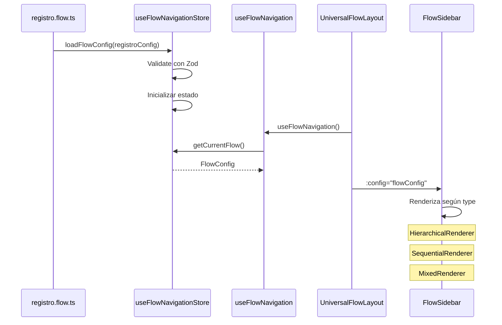

# TODO-001: Estructura de Datos - DOCUMENTACIÓN

**Objetivo:** Definir FlowItem y FlowConfig con estructura agrupada para el Sistema Universal de Sidebars

---

## 🎯 Objetivo

Crear las **estructuras de datos TypeScript** que servirán como fundamento para todo el Flow System de ProBO v3. Estas estructuras deben ser:

1. **Type-safe:** TypeScript estricto sin `any`
2. **Agrupadas:** Propiedades organizadas semánticamente
3. **Extensibles:** Fácil agregar nuevas propiedades
4. **Validables:** Con Zod para validación runtime
5. **Documentadas:** JSDoc completo en cada propiedad

---

## 📚 Contexto

### **Situación Actual**

Actualmente tenemos:

- ✅ Junta de Accionistas: Funcional pero con sidebar hardcodeado (168 líneas)
- ⚠️ Registro de Sociedades: Layout que oculta ProboSidebar
- ❌ Sucursales: Sin implementar

Cada flujo tiene su propia lógica de navegación y no se pueden reutilizar componentes.

### **Problema**

1. **Duplicación:** Cada flujo reinventa la rueda
2. **Mantenimiento:** Cambiar navegación requiere modificar múltiples archivos
3. **Inconsistencia:** UX diferente entre flujos
4. **Escalabilidad:** Agregar nuevo flujo = 200+ líneas de código

### **Necesidad**

Necesitamos una **abstracción única** que permita:

- Definir cualquier flujo con un simple archivo de configuración
- Reutilizar componentes entre flujos
- Mantener consistencia visual y funcional
- Escalar a 10+ flujos sin refactorización

---

## 💡 Solución Propuesta

### **Enfoque**

Crear dos entidades principales:

1. **FlowItem:** Representa un ítem individual en la navegación
2. **FlowConfig:** Representa la configuración completa de un flujo

Ambas usan **estructura agrupada** (grouped objects):

```typescript
// ❌ ANTES (flat)
interface FlowItem {
  id: string;
  label: string;
  level: number;
  path: string;
  icon: string;
  isOptional: boolean;
  // ... 15+ propiedades al mismo nivel
}

// ✅ DESPUÉS (grouped)
interface FlowItem {
  identity: {
    id: string;
    label: string;
    icon: string;
  };
  hierarchy: {
    level: 1 | 2 | 3 | 4;
    order: number;
    children?: FlowItem[];
  };
  navigation: {
    path: string;
  };
  behavior: {
    isOptional: boolean;
  };
  // ... grupos semánticos
}
```

**Ventajas:**

- 🧠 Mejor mental model (agrupación lógica)
- 🔍 Autocomplete más inteligente
- ✅ Validación por grupo
- 📦 Extensible sin romper

---

### **Alternativas Descartadas**

#### **1. Clases con OOP**

```typescript
class FlowItem {
  constructor(data) {
    /* validación */
  }
  isCompleted() {
    /* lógica */
  }
}
```

**Por qué NO:**

- ❌ No funciona bien con Vue 3 reactivity
- ❌ Difícil serializar/deserializar
- ❌ Overhead innecesario para datos simples

---

#### **2. Estructura Flat**

```typescript
interface FlowItem {
  id, label, level, path, icon, badge, ...
}
```

**Por qué NO:**

- ❌ Difícil de entender (todas las props mezcladas)
- ❌ Autocomplete confuso (30+ props)
- ❌ Difícil extender sin conflictos

---

#### **3. Múltiples Interfaces Específicas**

```typescript
interface RegistroFlowItem { ... }
interface JuntasFlowItem { ... }
interface SucursalesFlowItem { ... }
```

**Por qué NO:**

- ❌ Duplicación masiva
- ❌ Componentes no reutilizables
- ❌ No resuelve el problema raíz

---

### **Solución Elegida: Interfaces Agrupadas + Zod**

**Por qué SÍ:**

- ✅ TypeScript valida en build-time
- ✅ Zod valida en runtime
- ✅ Vue 3 reactivity funciona perfecto
- ✅ Serializable (JSON-friendly)
- ✅ Extensible con `metadata: Record<string, any>`
- ✅ Composables consumen naturalmente

---

## 🏗️ Diseño Técnico

### **Componentes**

#### **1. Value Objects (Domain Layer)**

Cada grupo es un Value Object:

```typescript
// app/types/flow-system/identity.ts
export interface FlowItemIdentity {
  /** Identificador único del item (usado en rutas y store) */
  id: string;

  /** Texto visible en el sidebar */
  label: string;

  /** Descripción opcional (tooltip o ayuda contextual) */
  description?: string;

  /** Icono de Lucide (ej: "building", "users") */
  icon?: string;

  /** Badge opcional (ej: "Nuevo", "Beta") */
  badge?: {
    text: string;
    variant: "default" | "secondary" | "destructive" | "outline";
  };
}
```

**Similares para:**

- `FlowItemHierarchy` (hierarchy.ts)
- `FlowItemNavigation` (navigation.ts)
- `FlowItemBehavior` (behavior.ts)
- `FlowItemRightSidebar` (right-sidebar.ts)
- `FlowItemValidation` (validation.ts)

---

#### **2. Entity FlowItem (Domain Layer)**

Composición de Value Objects:

```typescript
// app/types/flow-system/flow-item.ts
export interface FlowItem {
  /** Información de identificación del item */
  identity: FlowItemIdentity;

  /** Información jerárquica y posición en el árbol */
  hierarchy: FlowItemHierarchy;

  /** Información de navegación y rutas */
  navigation: FlowItemNavigation;

  /** Comportamiento del item (opcional, locked, etc) */
  behavior: FlowItemBehavior;

  /** Configuración del sidebar derecho (solo Juntas) */
  rightSidebar?: FlowItemRightSidebar;

  /** Reglas de validación */
  validation?: FlowItemValidation;

  /** Metadata custom para casos específicos */
  metadata?: Record<string, any>;
}
```

---

#### **3. Entity FlowConfig (Domain Layer)**

Configuración completa de un flujo:

```typescript
// app/types/flow-system/flow-config.ts
export interface FlowConfig {
  /** Identidad del flujo */
  identity: {
    id: string;
    name: string;
    description?: string;
  };

  /** Estructura del flujo */
  structure: {
    /** Tipo de navegación */
    type: "sequential" | "hierarchical" | "mixed";

    /** Niveles máximos permitidos */
    maxLevels: 1 | 2 | 3 | 4;

    /** Items de navegación */
    navigation: FlowItem[];
  };

  /** Reglas de navegación */
  navigationRules: {
    /** Permitir saltar pasos adelante */
    allowJumpAhead: boolean;

    /** Requiere completar pasos secuencialmente */
    requireSequential: boolean;

    /** Desbloquear siguiente automáticamente */
    autoUnlock: boolean;
  };

  /** Configuración de UI */
  ui: {
    /** Configuración sidebar izquierdo */
    leftSidebar: {
      enabled: boolean;
      collapsible: boolean;
      defaultCollapsed: boolean;
    };

    /** Configuración sidebar derecho */
    rightSidebar: {
      enabled: boolean;
      collapsible: boolean;
      defaultCollapsed: boolean;
    };

    /** Configuración header */
    header?: {
      enabled: boolean;
      title?: string;
      showProgress: boolean;
    };

    /** Configuración footer */
    footer?: {
      enabled: boolean;
      showButtons: boolean;
    };
  };

  /** Persistencia */
  persistence: {
    enabled: boolean;
    key: string;
    autosave: boolean;
    autosaveInterval?: number; // ms
  };

  /** Event handlers */
  events?: {
    onProgressUpdate?: (progress: number) => void;
    onFlowComplete?: () => void;
    onItemClick?: (itemId: string) => void;
    onItemComplete?: (itemId: string) => void;
  };

  /** Metadata custom */
  metadata?: Record<string, any>;
}
```

---

### **Flujo de Datos**



---

### **Integraciones**

#### **Con Vue Router:**

```typescript
// navigation.path se usa para router.push()
const navigateTo = (item: FlowItem) => {
  router.push(item.navigation.path);
};
```

#### **Con Pinia Store:**

```typescript
// Store almacena FlowConfig actual
const store = useFlowNavigationStore();
store.setFlowConfig(juntasConfig);
store.currentItemId = "datos-sociedad";
```

#### **Con Composables:**

```typescript
// Composable consume FlowConfig
const { next, previous, currentItem } = useFlowNavigation();
```

---

## 💻 Implementación

### **Estructura de Carpetas**

```
app/types/flow-system/
├── index.ts                 ← Export centralizado
├── identity.ts              ← FlowItemIdentity
├── hierarchy.ts             ← FlowItemHierarchy
├── navigation.ts            ← FlowItemNavigation
├── behavior.ts              ← FlowItemBehavior
├── right-sidebar.ts         ← FlowItemRightSidebar
├── validation.ts            ← FlowItemValidation
├── flow-item.ts             ← FlowItem (entity)
├── flow-config.ts           ← FlowConfig (entity)
└── schemas.ts               ← Zod schemas
```

---

### **Código Principal**

#### **index.ts (Export Centralizado)**

```typescript
// app/types/flow-system/index.ts

// Value Objects
export type { FlowItemIdentity } from "./identity";
export type { FlowItemHierarchy } from "./hierarchy";
export type { FlowItemNavigation } from "./navigation";
export type { FlowItemBehavior } from "./behavior";
export type { FlowItemRightSidebar } from "./right-sidebar";
export type { FlowItemValidation } from "./validation";

// Entities
export type { FlowItem } from "./flow-item";
export type { FlowConfig } from "./flow-config";

// Schemas (Zod)
export {
  FlowItemIdentitySchema,
  FlowItemHierarchySchema,
  FlowItemNavigationSchema,
  FlowItemBehaviorSchema,
  FlowItemRightSidebarSchema,
  FlowItemValidationSchema,
  FlowItemSchema,
  FlowConfigSchema,
} from "./schemas";

// Validators
export { validateFlowItem, validateFlowConfig } from "./schemas";
```

---

#### **identity.ts (Ejemplo)**

```typescript
// app/types/flow-system/identity.ts

/**
 * Información de identidad de un FlowItem
 */
export interface FlowItemIdentity {
  /**
   * Identificador único del item
   * Usado para:
   * - Guardar progreso en localStorage
   * - Buscar items en el árbol
   * - Sincronizar con backend
   *
   * @example "datos-sociedad"
   * @example "aumento-capital"
   */
  id: string;

  /**
   * Texto visible en el sidebar
   *
   * @example "Datos principales"
   * @example "Aumento de Capital"
   */
  label: string;

  /**
   * Descripción opcional
   * Se muestra en tooltip o ayuda contextual
   *
   * @example "Completa todos los datos básicos de la sociedad"
   */
  description?: string;

  /**
   * Icono de Lucide Icons
   *
   * @see https://lucide.dev/icons
   * @example "building"
   * @example "users"
   * @example "file-text"
   */
  icon?: string;

  /**
   * Badge opcional
   * Usado para resaltar items especiales
   */
  badge?: {
    /** Texto del badge */
    text: string;

    /** Variante visual */
    variant: "default" | "secondary" | "destructive" | "outline";
  };
}
```

---

### **Configuración**

#### **tsconfig.json** (ya existe, verificar paths)

```json
{
  "compilerOptions": {
    "strict": true,
    "paths": {
      "~/*": ["./app/*"],
      "@/*": ["./app/*"]
    }
  }
}
```

---

## ✅ Criterios de Aceptación

### **Funcionales:**

- [ ] **CA-1:** FlowItem interface definida con 7 grupos:
  - identity, hierarchy, navigation, behavior, rightSidebar, validation, metadata
- [ ] **CA-2:** FlowConfig interface definida con 6 grupos:
  - identity, structure, navigationRules, ui, persistence, events
- [ ] **CA-3:** 3 ejemplos completos y funcionales:
  - Registro Sociedades (10 items, sequential, level 1)
  - Sucursales (5 items, sequential, level 1)
  - Juntas (6+ items, hierarchical, levels 1-4, rightSidebar enabled)
- [ ] **CA-4:** Schemas Zod validan correctamente:
  - FlowItem válido → `.parse()` pasa
  - FlowItem inválido → `.parse()` lanza error con mensaje claro
- [ ] **CA-5:** Helpers funcionando:
  - `flattenFlowItems()` convierte árbol a array flat
  - `findFlowItemById()` encuentra item por ID
  - `getAllFlowItemIds()` retorna todos los IDs

---

### **Técnicos:**

- [ ] **CT-1:** TypeScript strict mode sin errores ni warnings
- [ ] **CT-2:** Todos los tipos exportados desde `index.ts`
- [ ] **CT-3:** JSDoc completo en:
  - Todas las interfaces
  - Todas las propiedades
  - Todos los tipos complejos
- [ ] **CT-4:** Ejemplos ejecutables:
  - Se pueden importar sin error
  - TypeScript autocomplete funciona
  - No hay `any` ni `unknown` sin justificar
- [ ] **CT-5:** Zod instalado correctamente:
  - `package.json` incluye zod
  - Schemas importables sin error

---

### **De Calidad:**

- [ ] **CQ-1:** Código reviewed por Usuario
- [ ] **CQ-2:** Documentación sin ambigüedades
- [ ] **CQ-3:** Ejemplos realistas (basados en flujos reales)
- [ ] **CQ-4:** Tests unitarios para helpers (>90% coverage)
- [ ] **CQ-5:** Consistencia en naming:
  - Interfaces: PascalCase (FlowItem)
  - Propiedades: camelCase (leftSidebar)
  - Constantes: UPPER_SNAKE_CASE (si aplica)

---

## 🧪 Testing

### **Tests Unitarios**

```typescript
// app/types/flow-system/__tests__/schemas.test.ts

import { describe, it, expect } from "vitest";
import {
  FlowItemSchema,
  FlowConfigSchema,
  validateFlowItem,
  validateFlowConfig,
} from "../schemas";

describe("FlowItemSchema", () => {
  it("should validate correct FlowItem", () => {
    const validItem = {
      identity: {
        id: "test-id",
        label: "Test Label",
      },
      hierarchy: {
        level: 1,
        order: 1,
      },
      navigation: {
        path: "/test",
      },
      behavior: {
        isOptional: false,
        isLocked: false,
        requiresCompletion: true,
      },
    };

    expect(() => FlowItemSchema.parse(validItem)).not.toThrow();
  });

  it("should reject FlowItem without required fields", () => {
    const invalidItem = {
      identity: {
        id: "test-id",
        // Falta label (required)
      },
    };

    expect(() => FlowItemSchema.parse(invalidItem)).toThrow();
  });

  it("should reject invalid level", () => {
    const invalidItem = {
      identity: { id: "test", label: "Test" },
      hierarchy: {
        level: 5, // ❌ Solo 1-4 permitidos
        order: 1,
      },
      navigation: { path: "/test" },
      behavior: {},
    };

    expect(() => FlowItemSchema.parse(invalidItem)).toThrow();
  });
});

describe("FlowItem Helpers", () => {
  const mockTree: FlowItem[] = [
    {
      identity: { id: "parent", label: "Parent" },
      hierarchy: { level: 1, order: 1 },
      navigation: { path: "/parent" },
      behavior: {},
      children: [
        {
          identity: { id: "child1", label: "Child 1" },
          hierarchy: { level: 2, order: 1, parentId: "parent" },
          navigation: { path: "/parent/child1" },
          behavior: {},
        },
        {
          identity: { id: "child2", label: "Child 2" },
          hierarchy: { level: 2, order: 2, parentId: "parent" },
          navigation: { path: "/parent/child2" },
          behavior: {},
          children: [
            {
              identity: { id: "grandchild", label: "Grandchild" },
              hierarchy: { level: 3, order: 1, parentId: "child2" },
              navigation: { path: "/parent/child2/grandchild" },
              behavior: {},
            },
          ],
        },
      ],
    },
  ];

  it("should flatten nested FlowItems", () => {
    const flat = flattenFlowItems(mockTree);
    expect(flat).toHaveLength(4); // parent + 2 children + 1 grandchild
    expect(flat.map((item) => item.identity.id)).toEqual([
      "parent",
      "child1",
      "child2",
      "grandchild",
    ]);
  });

  it("should find item by ID (DFS)", () => {
    const found = findFlowItemById(mockTree, "grandchild");
    expect(found).toBeDefined();
    expect(found?.identity.id).toBe("grandchild");
    expect(found?.hierarchy.level).toBe(3);
  });

  it("should return null if ID not found", () => {
    const found = findFlowItemById(mockTree, "non-existent");
    expect(found).toBeNull();
  });

  it("should get all IDs", () => {
    const ids = getAllFlowItemIds(mockTree);
    expect(ids).toEqual(["parent", "child1", "child2", "grandchild"]);
  });
});
```

---

### **Tests Manuales**

#### **Paso 1: Verificar TypeScript Autocomplete**

1. Abrir VSCode
2. Crear archivo `test-flow.ts`
3. Importar FlowItem: `import type { FlowItem } from '~/types/flow-system'`
4. Crear objeto: `const item: FlowItem = {`
5. **Esperado:** Autocomplete muestra grupos: identity, hierarchy, navigation, etc.
6. Dentro de identity: **Esperado:** Autocomplete muestra id, label, description, etc.

#### **Paso 2: Verificar Validación TypeScript**

1. Crear FlowItem sin `identity.label`
2. **Esperado:** TypeScript error "Property 'label' is required"
3. Agregar `identity.label`
4. **Esperado:** Error desaparece

#### **Paso 3: Verificar Zod Runtime Validation**

1. Ejecutar: `npm run test`
2. **Esperado:** Tests de schemas pasan
3. Crear FlowItem inválido en código
4. Llamar `validateFlowItem(invalidItem)`
5. **Esperado:** Zod lanza error con mensaje claro

---

## 📊 Métricas de Éxito

### **Cobertura de Tests:**

- **Target:** >90% en `schemas.ts` y helpers
- **Medir con:** `npm run test:coverage`

### **TypeScript Strictness:**

- **Target:** 0 errores, 0 warnings, 0 uso de `any`
- **Verificar con:** `npm run type-check`

### **Uso:**

- ✅ 3 flujos usan FlowItem y FlowConfig
- ✅ Composables y components importan desde `~/types/flow-system`
- ✅ 0 duplicación de tipos

### **Mantenibilidad:**

- ✅ Agregar nuevo grupo: <30 min
- ✅ Cambiar estructura: modificar 1 archivo
- ✅ Nuevo dev entiende estructura: <15 min

---

## 🚨 Riesgos y Mitigación

| Riesgo                            | Impacto | Prob  | Mitigación                              |
| --------------------------------- | ------- | ----- | --------------------------------------- |
| **Zod no instalado**              | Medio   | Baja  | Instalar: `npm install zod`             |
| **Estructura muy rígida**         | Alto    | Media | Usar `metadata: Record<string, any>`    |
| **Validación Zod lenta**          | Bajo    | Baja  | Solo validar en dev, cachear en prod    |
| **TypeScript autocomplete lento** | Bajo    | Baja  | Tipos están optimizados (no computados) |

---

## 📖 Referencias

### **Documentación Interna:**

- [variables/flow-objects.md](../variables/flow-objects.md) - Ejemplos completos de los 3 flujos
- [INSTRUCTIONS.md](../../INSTRUCTIONS.md) - Metodología de trabajo
- [ROADMAP.md](../ROADMAP.md) - Plan general del proyecto

### **Documentación Externa:**

- [TypeScript: Interfaces](https://www.typescriptlang.org/docs/handbook/2/objects.html)
- [TypeScript: Mapped Types](https://www.typescriptlang.org/docs/handbook/2/mapped-types.html)
- [Zod Documentation](https://zod.dev/)
- [Zod: Object Schemas](https://zod.dev/?id=objects)
- [DDD: Value Objects](https://martinfowler.com/bliki/ValueObject.html)
- [DDD: Entities](https://martinfowler.com/bliki/EvansClassification.html)

### **Ejemplos en el Proyecto:**

- `app/types/user.ts` - Ejemplo de tipos agrupados existente
- `app/types/navigation.ts` - Ejemplo de navegación existente

---

## 📝 Notas Adicionales

### **Extensibilidad Futura:**

Si en el futuro necesitamos agregar:

**Nuevo grupo en FlowItem:**

```typescript
// Agregar nuevo archivo
// app/types/flow-system/analytics.ts
export interface FlowItemAnalytics {
  trackEvent?: string;
  trackProperties?: Record<string, any>;
}

// Agregar a FlowItem
interface FlowItem {
  // ... grupos existentes
  analytics?: FlowItemAnalytics; // ← Nuevo
}
```

**Nueva propiedad en grupo existente:**

```typescript
// Solo modificar identity.ts
export interface FlowItemIdentity {
  id: string
  label: string
  description?: string
  icon?: string
  badge?: { ... }
  emoji?: string // ← Nuevo
}
```

**Nuevo tipo de flujo:**

```typescript
// En flow-config.ts
interface FlowConfig {
  structure: {
    type: "sequential" | "hierarchical" | "mixed" | "wizard"; // ← Nuevo
    // ...
  };
}
```

---

### **Convenciones de Código:**

1. **Interfaces:**
   - Nombres en PascalCase
   - Sin prefijo `I` (no `IFlowItem`, solo `FlowItem`)
2. **Propiedades:**
   - camelCase siempre
   - Opcionales con `?`
   - Documentar con JSDoc si no es obvio
3. **Comentarios:**
   - JSDoc para propiedades públicas
   - `@example` cuando ayude
   - `@see` para links externos
4. **Tipos vs Interfaces:**
   - Usar `interface` para objetos (extensible)
   - Usar `type` para unions/intersections

---

**Estado:** 📝 Documentación Completa - Listo para Implementación  
**Última Actualización:** 2 de Noviembre, 2025  
**Siguiente Acción:** Usuario aprueba documentación → Crear archivos TypeScript
