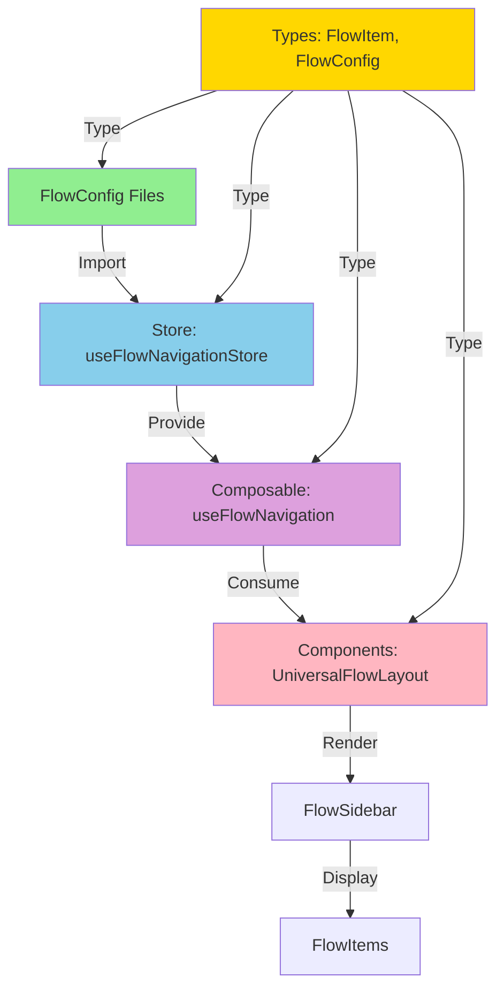

# TODO-001: Estructura de Datos - ROADMAP

**Objetivo:** Definir FlowItem y FlowConfig con estructura agrupada  
**Prioridad:** 🔥 Alta (crítico)  
**Estimación:** 4 horas (1h decisiones + 3h documentación)  
**Estado:** 🚧 En Progreso

---

## 1. 🎯 DECISIONES

### Decisión 1: ¿Clases (OOP) o Interfaces (Functional)?

**Contexto:** Necesitamos definir cómo representar FlowItem y FlowConfig en TypeScript.

#### **Opción A: Clases con Validación en Constructor**

```typescript
class FlowItem {
  constructor(data: FlowItemInput) {
    // Validación en constructor
    if (!data.identity.id) throw new Error("ID required");
    this.identity = data.identity;
    // ...
  }
}
```

**Pros:**

- ✅ Validación automática al crear instancias
- ✅ Encapsulación de lógica de negocio
- ✅ Métodos propios (ej: `item.isCompleted()`)
- ✅ Fail-fast (errores tempranos)

**Contras:**

- ❌ Más complejo para serializar/deserializar
- ❌ No funciona bien con composables de Vue
- ❌ Dificulta la reactividad de Vue 3

---

#### **Opción B: Interfaces + Funciones de Validación**

```typescript
interface FlowItem {
  identity: { id: string; label: string };
  hierarchy: { level: 1 | 2 | 3 | 4; order: number };
  // ...
}

function validateFlowItem(item: FlowItem): boolean {
  // Validación externa
}
```

**Pros:**

- ✅ Simple y directo
- ✅ Compatible con Vue 3 reactivity
- ✅ Fácil de serializar (JSON.stringify)
- ✅ Composables funcionan naturalmente
- ✅ TypeScript valida estructura

**Contras:**

- ❌ Validación manual (no automática)
- ❌ Sin encapsulación de lógica

---

#### **Opción C: Híbrido (Clases en Domain, Interfaces en resto)**

```typescript
// Domain Layer (entities)
class FlowItemEntity {
  constructor(data: FlowItemInput) {
    // Validación estricta
  }
}

// Application/Presentation Layers
interface FlowItem {
  // Interface simple
}
```

**Pros:**

- ✅ Lo mejor de ambos mundos
- ✅ Domain protegido
- ✅ Application/UI simple

**Contras:**

- ❌ Más complejo de mantener
- ❌ Conversiones entre clase e interface
- ❌ Overhead en arquitectura

---

#### ✅ **RECOMENDACIÓN: Opción B (Interfaces + Validación Externa)**

**Justificación:**

1. **Vue 3 First:** Nuxt 4 usa Vue 3 Composition API y reactividad. Interfaces funcionan mejor.
2. **Simplicidad:** No necesitamos lógica de negocio compleja en FlowItem (solo datos).
3. **Serialización:** Configuraciones se definirán en archivos `.ts` y se importarán. JSON-friendly es clave.
4. **Validación:** Podemos usar Zod/Valibot en composables para validar cuando sea necesario.
5. **TypeScript:** Con `strict: true`, TypeScript ya valida estructura en compile-time.

**Trade-offs Aceptados:**

- ❌ Validación no automática → Solución: Validar en composables con Zod
- ❌ Sin métodos propios → Solución: Funciones utilitarias (ej: `isFlowItemCompleted(item)`)

---

### Decisión 2: ¿Dónde Validamos los Datos?

**Contexto:** Si usamos interfaces, ¿dónde validamos que los datos sean correctos?

#### **Opción A: En el Constructor (N/A si usamos interfaces)**

```typescript
// No aplica con interfaces
```

---

#### **Opción B: En Composables (Al Usar)**

```typescript
const { validateFlowConfig } = useFlowNavigation()

const config = defineFlowConfig({ ... })
validateFlowConfig(config) // Valida cuando se usa
```

**Pros:**

- ✅ Flexible (valida solo cuando necesario)
- ✅ No afecta carga inicial
- ✅ Puede validar en runtime

**Contras:**

- ❌ Fácil olvidar validar
- ❌ Errores más tarde en ejecución

---

#### **Opción C: Validación Doble (Build-time + Runtime)**

```typescript
// Build-time: TypeScript valida estructura
const config: FlowConfig = { ... } // TS error si falta algo

// Runtime: Zod valida datos dinámicos
const FlowConfigSchema = z.object({ ... })
FlowConfigSchema.parse(config) // Valida en runtime
```

**Pros:**

- ✅ Build-time: TypeScript catch errors
- ✅ Runtime: Zod catch errors dinámicos
- ✅ Doble protección

**Contras:**

- ❌ Más setup (definir schemas)
- ❌ Overhead en runtime

---

#### ✅ **RECOMENDACIÓN: Opción C (Validación Doble)**

**Justificación:**

1. **TypeScript:** Valida estructura en desarrollo (autocomplete + errores).
2. **Zod:** Valida datos en runtime (especialmente si vienen de API futura).
3. **Best Practice:** Doble validación es estándar en apps modernas.

**Implementación:**

```typescript
// 1. TypeScript types (compile-time)
export interface FlowItem { ... }

// 2. Zod schemas (runtime)
export const FlowItemSchema = z.object({ ... })

// 3. Helper de validación
export function validateFlowItem(item: unknown): FlowItem {
  return FlowItemSchema.parse(item) // Throw si falla
}
```

---

### Decisión 3: ¿Cómo Manejamos `children`?

**Contexto:** Flujos jerárquicos (Juntas) tienen items anidados hasta 4 niveles.

#### **Opción A: Array Recursivo `children?: FlowItem[]`**

```typescript
interface FlowItem {
  identity: { id: string };
  hierarchy: { level: 1 | 2 | 3 | 4 };
  children?: FlowItem[]; // ← Recursivo
}

const flow: FlowItem[] = [
  {
    identity: { id: "parent" },
    hierarchy: { level: 1 },
    children: [
      {
        identity: { id: "child" },
        hierarchy: { level: 2 },
        children: [
          /* ... */
        ],
      },
    ],
  },
];
```

**Pros:**

- ✅ Natural para representar jerarquía
- ✅ Fácil de renderizar (recursión en componente)
- ✅ Mantiene estructura de árbol
- ✅ Fácil de buscar con DFS/BFS

**Contras:**

- ❌ Difícil hacer flat (necesitas función helper)
- ❌ Búsqueda por ID requiere recursión

---

#### **Opción B: Flat Array con `parentId`**

```typescript
interface FlowItem {
  identity: { id: string };
  hierarchy: { level: 1 | 2 | 3 | 4; parentId?: string };
  // Sin children
}

const flow: FlowItem[] = [
  { identity: { id: "parent" }, hierarchy: { level: 1 } },
  { identity: { id: "child" }, hierarchy: { level: 2, parentId: "parent" } },
  { identity: { id: "grandchild" }, hierarchy: { level: 3, parentId: "child" } },
];
```

**Pros:**

- ✅ Búsqueda por ID es O(n) simple
- ✅ Fácil iterar todos los items
- ✅ No requiere recursión

**Contras:**

- ❌ No natural para jerarquía
- ❌ Renderizar requiere reconstruir árbol
- ❌ Más complejo para validar niveles

---

#### ✅ **RECOMENDACIÓN: Opción A (Array Recursivo con `children`)**

**Justificación:**

1. **Natural:** La estructura de archivos `.flow.ts` será más legible.
2. **Rendering:** Componentes Vue pueden usar `<component v-for>` recursivamente.
3. **DFS/BFS:** Tenemos helpers para convertir a flat si es necesario.
4. **Casos de Uso:**
   - Registro: No usa children (nivel 1 solo)
   - Juntas: Usa children (hasta nivel 4)
   - Sucursales: No usa children (nivel 1 solo)

**Helpers a Crear:**

```typescript
// Convertir árbol → flat
function flattenFlowItems(items: FlowItem[]): FlowItem[];

// Buscar por ID (DFS)
function findFlowItemById(items: FlowItem[], id: string): FlowItem | null;

// Obtener todos los IDs
function getAllFlowItemIds(items: FlowItem[]): string[];
```

**Trade-offs Aceptados:**

- ❌ Búsqueda no es O(1) → Solución: Crear Map<id, item> en store si es necesario

---

## 2. 🏗️ ARQUITECTURA

### **Integración con el Sistema**



### **Capas Afectadas (DDD Hexagonal)**

#### **Domain Layer** (Entities, Value Objects)

```
app/types/flow-system/
├── identity.ts          ← Value Object
├── hierarchy.ts         ← Value Object
├── navigation.ts        ← Value Object
├── behavior.ts          ← Value Object
├── right-sidebar.ts     ← Value Object
├── validation.ts        ← Value Object
├── flow-item.ts         ← Entity (composición)
└── flow-config.ts       ← Entity (composición)
```

**Responsabilidad:** Definir la estructura pura de datos (sin lógica).

---

#### **Application Layer** (Use Cases, Composables)

```
app/composables/flows/
└── useFlowNavigation.ts ← Consume FlowConfig

app/stores/
└── useFlowNavigationStore.ts ← Almacena FlowConfig actual
```

**Responsabilidad:** Usar las entidades del dominio.

---

#### **Infrastructure Layer** (Implementaciones)

```
app/config/flows/
├── registro-sociedades.flow.ts  ← FlowConfig concreto
├── sucursales.flow.ts           ← FlowConfig concreto
└── juntas-accionistas.flow.ts   ← FlowConfig concreto
```

**Responsabilidad:** Configuraciones específicas.

---

#### **Presentation Layer** (UI Components)

```
app/components/flow-system/
├── UniversalFlowLayout.vue ← Orquestador
├── FlowSidebar.vue         ← Sidebar adaptable
└── renderers/
    ├── HierarchicalRenderer.vue
    └── SequentialRenderer.vue
```

**Responsabilidad:** Renderizar según FlowConfig.

---

### **Patrones Usados**

1. **DDD (Domain-Driven Design):**

   - FlowItem y FlowConfig son entidades del dominio
   - Value Objects para cada grupo (identity, hierarchy, etc.)

2. **Hexagonal Architecture:**

   - Domain (types) → Application (composables) → Infrastructure (configs) → Presentation (components)

3. **Composite Pattern:**

   - FlowItem puede contener children (FlowItem[])
   - Permite estructura de árbol recursiva

4. **Strategy Pattern (futuro):**
   - Diferentes renderers según tipo de flujo
   - HierarchicalRenderer vs SequentialRenderer

---

### **Relaciones con Otros TODOs**

| TODO         | Relación | Descripción                                       |
| ------------ | -------- | ------------------------------------------------- |
| **TODO-002** | Bloquea  | Define dónde viven estos tipos en la arquitectura |
| **TODO-003** | Bloquea  | Store necesita FlowConfig definido                |
| **TODO-004** | Bloquea  | Composable consume FlowItem y FlowConfig          |
| **TODO-005** | Bloquea  | Layout renderiza según FlowConfig                 |

---

## 3. 📋 ISSUES

### **Issue 1: Crear Value Objects**

**Descripción:** Crear tipos agrupados para cada sección de FlowItem

**Archivos a crear:**

- `app/types/flow-system/identity.ts`
- `app/types/flow-system/hierarchy.ts`
- `app/types/flow-system/navigation.ts`
- `app/types/flow-system/behavior.ts`
- `app/types/flow-system/right-sidebar.ts`
- `app/types/flow-system/validation.ts`

**Tiempo:** 30 min

---

### **Issue 2: Crear Entity FlowItem**

**Descripción:** Componer FlowItem desde Value Objects

**Archivo a crear:**

- `app/types/flow-system/flow-item.ts`

**Tiempo:** 15 min

---

### **Issue 3: Crear Entity FlowConfig**

**Descripción:** Definir FlowConfig agrupado

**Archivo a crear:**

- `app/types/flow-system/flow-config.ts`

**Tiempo:** 30 min

---

### **Issue 4: Crear Schemas Zod**

**Descripción:** Crear validadores runtime para FlowItem y FlowConfig

**Archivos a crear:**

- `app/types/flow-system/schemas.ts`

**Tiempo:** 45 min

---

### **Issue 5: Crear Helpers**

**Descripción:** Funciones utilitarias para trabajar con FlowItems

**Archivo a crear:**

- `app/utils/flow-system/flow-item-helpers.ts`

**Funciones:**

- `flattenFlowItems(items: FlowItem[]): FlowItem[]`
- `findFlowItemById(items: FlowItem[], id: string): FlowItem | null`
- `getAllFlowItemIds(items: FlowItem[]): string[]`
- `getFlowItemLevel(item: FlowItem): 1|2|3|4`
- `hasChildren(item: FlowItem): boolean`

**Tiempo:** 1 hora

---

### **Issue 6: Documentar Ejemplos**

**Descripción:** Crear ejemplos completos de FlowItem y FlowConfig

**Archivos a crear:**

- En `todo-001-estructura-datos.variables-flowItem.md`
- En `todo-001-estructura-datos.variables-flowConfig.md`

**Tiempo:** 1 hora

---

## 4. ⏱️ ESTIMACIÓN

### **Desglose:**

- Decisiones (esta sección): ✅ 1 hora (COMPLETO)
- Issue 1 (Value Objects): 30 min
- Issue 2 (FlowItem Entity): 15 min
- Issue 3 (FlowConfig Entity): 30 min
- Issue 4 (Schemas Zod): 45 min
- Issue 5 (Helpers): 1 hora
- Issue 6 (Ejemplos): 1 hora

**Total:** 4 horas

### **Complejidad:** Media

- Tipos son straightforward
- Schemas Zod requieren precisión
- Helpers requieren tests

### **Prioridad:** 🔥 Alta (crítico)

- Bloquea TODO-002, TODO-003, TODO-004
- Es el fundamento de todo el sistema

### **Riesgo:** Bajo

- No hay dependencias externas
- Solo TypeScript y Zod (ya en proyecto)
- No hay lógica compleja

---

## 5. 🔗 DEPENDENCIAS

### **Depende de:**

- ✅ Ninguno (es el primer TODO)

### **Bloquea a:**

- ⏳ TODO-002 (Arquitectura de Capas)
- ⏳ TODO-003 (Store Principal)
- ⏳ TODO-004 (Composable API)

### **Requisitos Técnicos:**

- TypeScript 5.x (✅ ya en proyecto)
- Zod (⚠️ verificar si está instalado, sino instalar)

---

## 6. ✅ CRITERIOS DE ACEPTACIÓN

### **Criterios Funcionales:**

- [ ] FlowItem interface definida con estructura agrupada
- [ ] FlowConfig interface definida con estructura agrupada
- [ ] 3 ejemplos completos (Registro, Sucursales, Juntas)
- [ ] Schemas Zod creados y validando correctamente
- [ ] Helpers funcionando con tests pasando

### **Criterios Técnicos:**

- [ ] TypeScript strict mode sin errores
- [ ] Tipos exportados desde `index.ts` centralizado
- [ ] JSDoc completo en todas las interfaces
- [ ] Ejemplos ejecutables (se pueden importar sin error)

### **Criterios de Calidad:**

- [ ] Código reviewed y aprobado
- [ ] Documentación clara y sin ambigüedades
- [ ] Ejemplos realistas (basados en flujos reales)

---

## 7. 🧪 PLAN DE TESTING

### **Tests Unitarios:**

```typescript
describe('FlowItem Schema', () => {
  it('should validate correct FlowItem', () => {
    const valid = { identity: {...}, hierarchy: {...} }
    expect(() => FlowItemSchema.parse(valid)).not.toThrow()
  })

  it('should reject invalid FlowItem', () => {
    const invalid = { identity: { id: null } }
    expect(() => FlowItemSchema.parse(invalid)).toThrow()
  })
})

describe('FlowItem Helpers', () => {
  it('should flatten nested FlowItems', () => {
    const nested = [/* árbol */]
    const flat = flattenFlowItems(nested)
    expect(flat).toHaveLength(10)
  })

  it('should find item by ID', () => {
    const items = [/* árbol */]
    const found = findFlowItemById(items, 'child-id')
    expect(found?.identity.id).toBe('child-id')
  })
})
```

### **Tests de Integración:**

- N/A (no hay integración aún, solo tipos)

### **Tests Manuales:**

1. Importar FlowItem en componente de prueba
2. Crear objeto con autocomplete de TypeScript
3. Validar que TypeScript detecta errores
4. Validar con Zod y verificar errores runtime

---

## 8. 📊 MÉTRICAS DE ÉXITO

### **Cobertura de Tests:**

- Target: >90% (tipos + schemas + helpers)

### **Uso:**

- Todos los archivos `.flow.ts` usan estos tipos
- Composables y components usan estos tipos
- 0 uso de `any` en tipos relacionados

### **Mantenibilidad:**

- Cambiar estructura de FlowItem debe ser cambio en 1 archivo
- Agregar nuevo grupo debe ser <30 min

---

## 9. 🚨 RIESGOS Y MITIGACIÓN

| Riesgo                | Impacto | Probabilidad | Mitigación                                               |
| --------------------- | ------- | ------------ | -------------------------------------------------------- |
| Zod no instalado      | Medio   | Baja         | Instalar con `npm install zod`                           |
| Estructura muy rígida | Alto    | Media        | Usar `metadata: Record<string, any>` para extensibilidad |
| Validación lenta      | Bajo    | Baja         | Validar solo en desarrollo, cachear en producción        |

---

## 10. 📖 REFERENCIAS

### **Documentación Interna:**

- [variables/flow-objects.md](../variables/flow-objects.md) - Ejemplos completos
- [INSTRUCTIONS.md](../../INSTRUCTIONS.md) - Metodología

### **Documentación Externa:**

- [TypeScript Handbook - Interfaces](https://www.typescriptlang.org/docs/handbook/2/objects.html)
- [Zod Documentation](https://zod.dev/)
- [DDD Value Objects](https://martinfowler.com/bliki/ValueObject.html)

---

## 11. 📝 NOTAS ADICIONALES

### **Decisiones Finales Tomadas:**

1. ✅ **Interfaces (no clases)** - Justificado por compatibilidad Vue 3
2. ✅ **Validación doble** (TypeScript + Zod) - Protección build + runtime
3. ✅ **Children recursivo** - Natural para jerarquía, helpers para flat

### **Próximos Pasos:**

1. ✅ Usuario aprueba este roadmap
2. Crear archivos de documentación complementarios
3. Implementar tipos según Issues 1-6
4. Validar con ejemplos reales (Registro, Juntas, Sucursales)
5. Mover a `todos-pulidos/` cuando esté aprobado

---

**Estado:** 🟡 Decisiones Completadas - Pendiente Aprobación  
**Última Actualización:** 2 de Noviembre, 2025  
**Siguiente Acción:** Usuario revisa y aprueba decisiones
